# Section 3

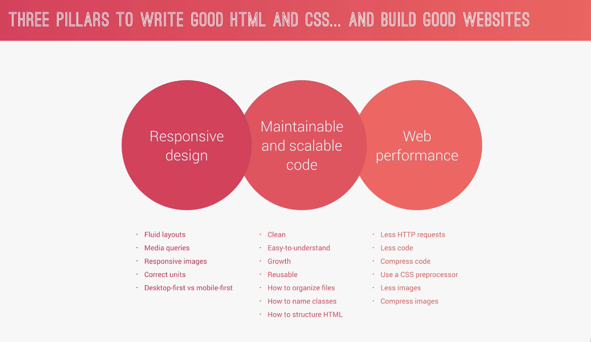

- img 쓰는걸 최대한 '지양' 해야된다. http request 쓰는건 perfomance issue 있는거다

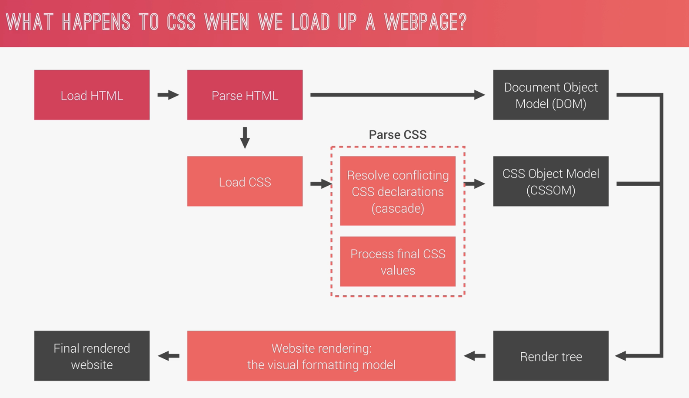

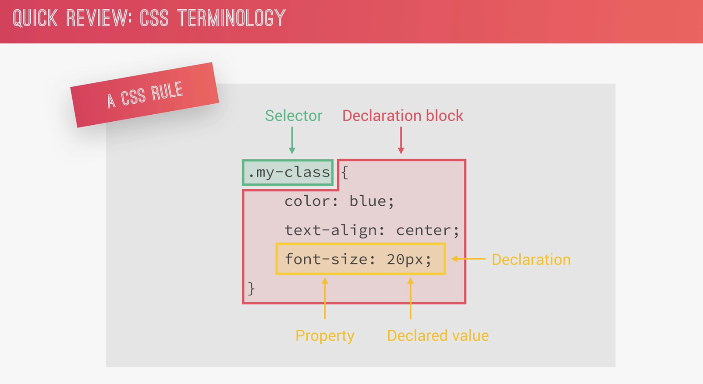

## CASCADE

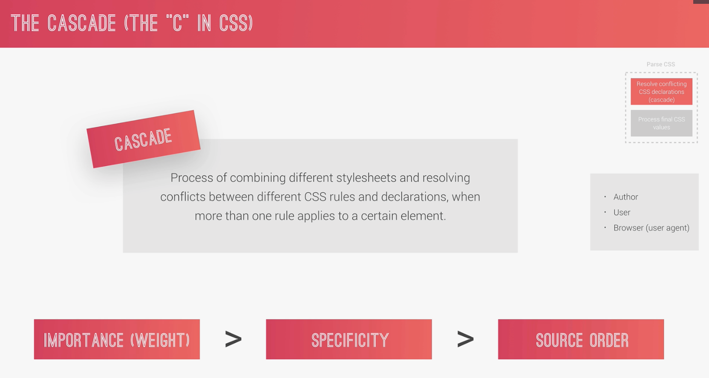

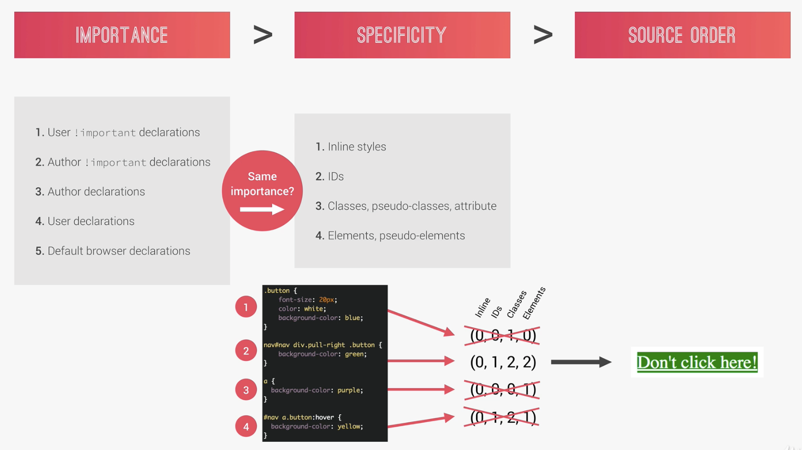

- 위의 경우, hover 되도 색깔 안바뀐다....

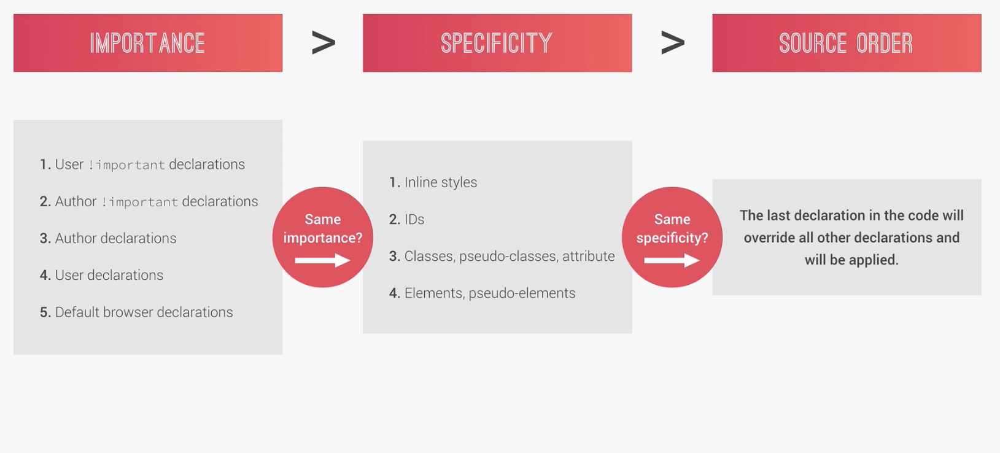

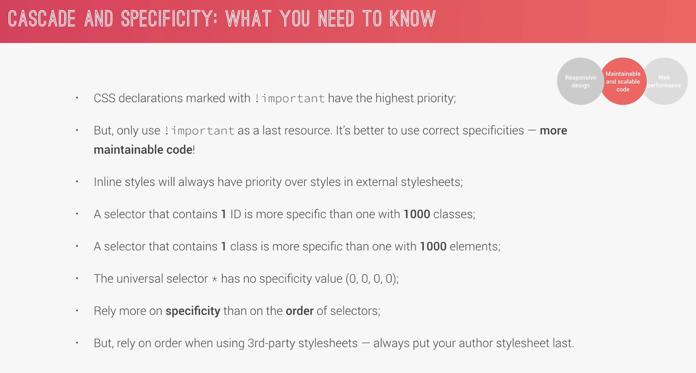

## Value processing  (e.g) vw, vh, em, rem )

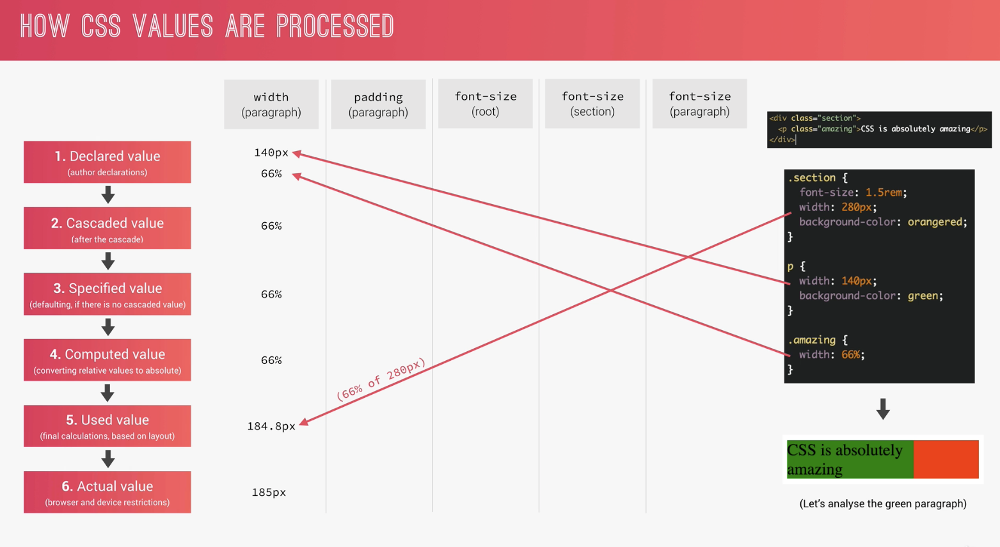

### rem :: inherited by 'root'

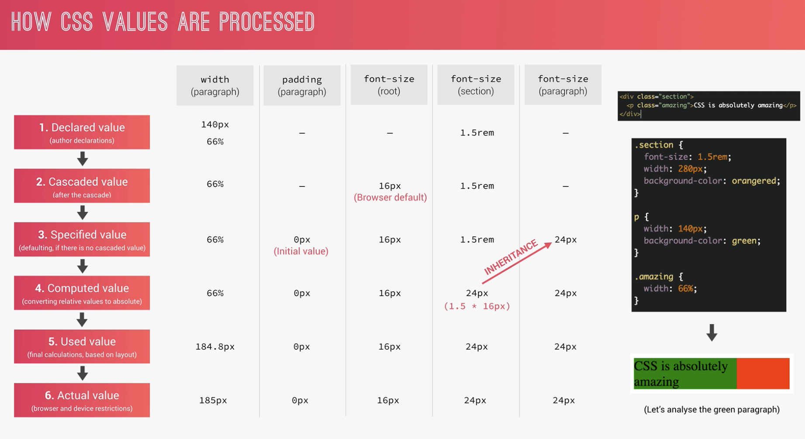

### Convert process

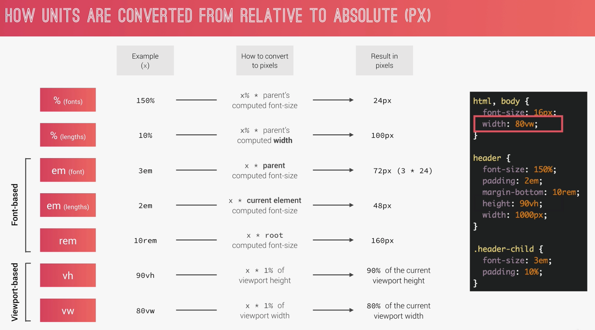

## Summary

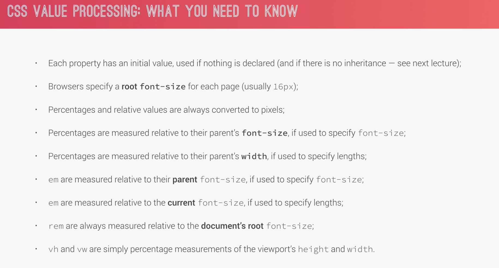

## Inheritance

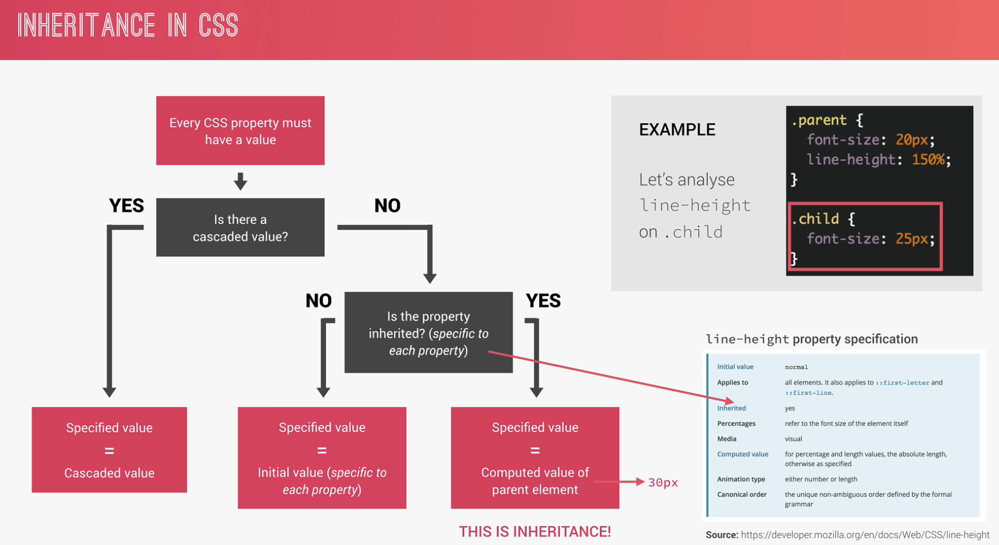

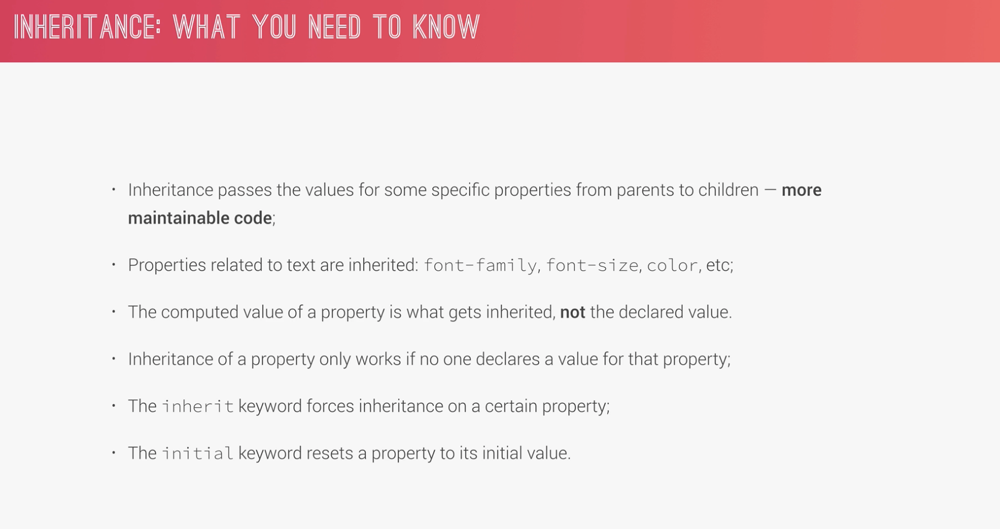