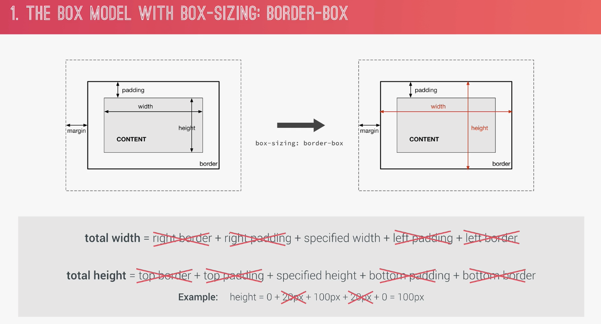

# Section 3

- img 쓰는걸 최대한 '지양' 해야된다. http request 쓰는건 perfomance issue 있는거다

## CASCADE

- 위의 경우, hover 되도 색깔 안바뀐다....

## Value processing (e.g) vw, vh, em, rem )

### rem :: inherited by 'root'

### Convert process

## Summary

## Inheritance

## 19. How CSS Renders a Website : The Visual Formatting Model

### Border-box!

### Box-types!

- block
- inline-block
- inline

### Positioning

- normal flow
- floats
- absolute positioning

### Stacking contexts

## CSS Architecture, Components and BEM

### Think ( component-driven design, atomic design)

### Build ( BEM, Block Element Modifier)

### Architect

- 7-1 pattern

### BEM

- header: block (can stand alone)
- logo-box: element (can't stand alone)

- two underscore ( block - element)
- two dash (block - modifier)
