## Three pillars to write Good HTML and CSS

### Responsive design
- Fluid layouts
- Media queries
- Responsive images
- Correct units
- Desktop-first vs mobile-first

### Maintainable and scalable code
- Clean
- Easy-to-understand
- Growth
- Reusable
- How to organize files
- How to name classes
- How to structure HTML

### Web performance
- Less HTTP requests
- Less code
- compress code
- Use a CSS preprocessor
- Less images
- Compress images

### What Happens to css when we load up a webpage
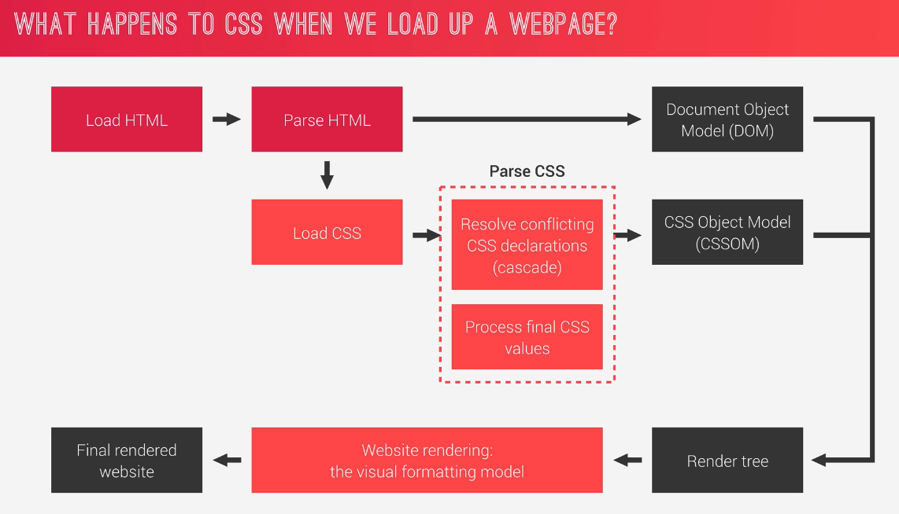

### CASCADE
- Process of combining different stylesheets and resolving conflicts between different CSS rules and declarations, when more than one rule applies to a certain element.
- Author(developer), User, Browser(user-agent)에 의해서 결정 됨

>왼쪽(우선순위 높음), 오른쪽으로 갈수록 우선순위가 낮다.
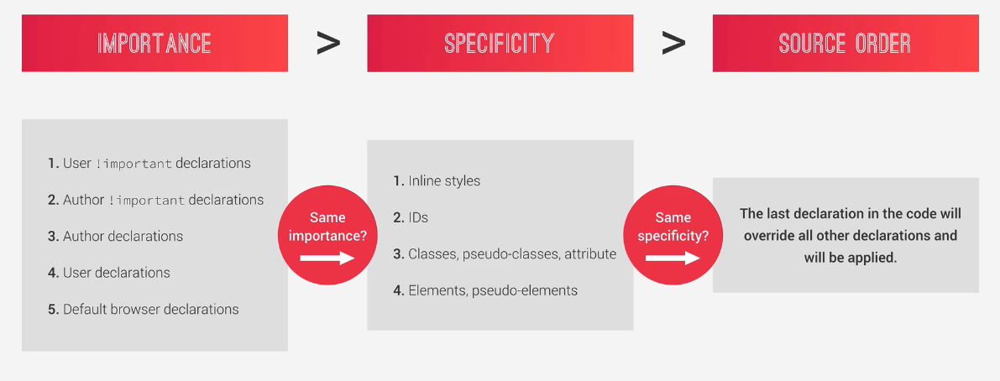
 
>숫자는 갯수를 의미한다. \
(0,0,1,0), (0,1,2,2), (0,0,0,1), (0,1,2,1) 중에서 (0,1,2,2)가 우선순위가 제일 높으므로 선택됨
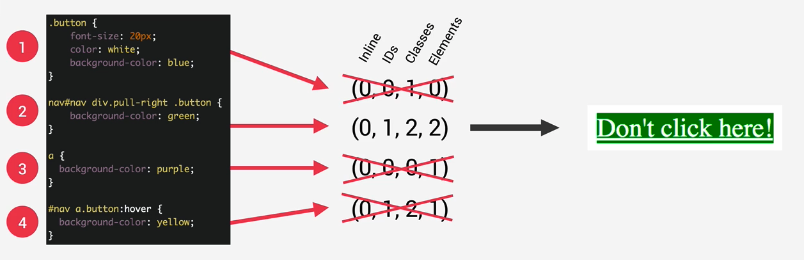
> 
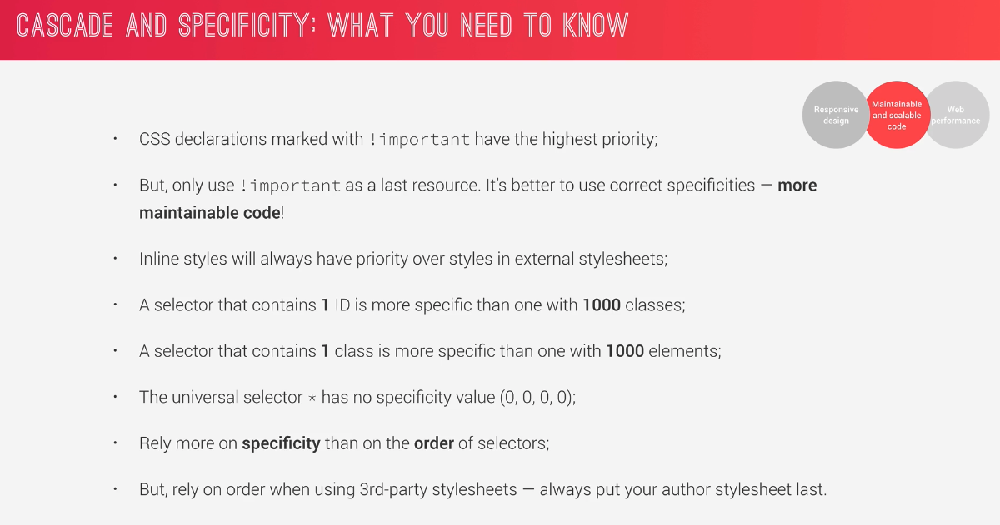

 > 1에서 6으로 계산되는 실제로 최종적으로 계산되는 과정을 나타낸다. 
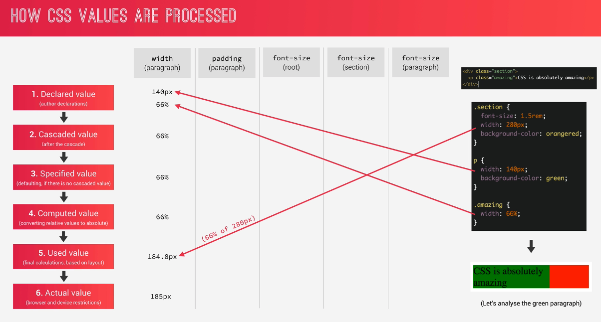
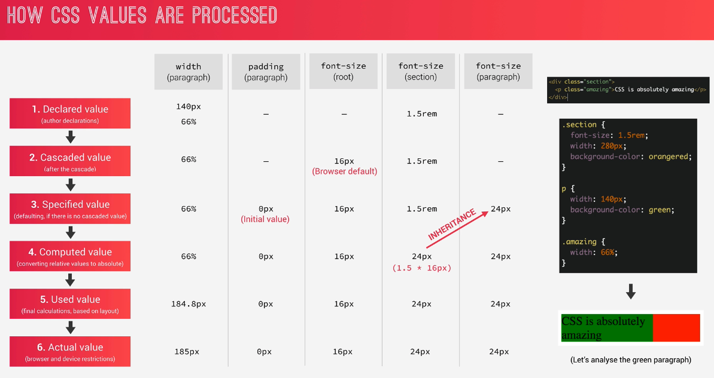

> em을 길이로 사용할 경우 current element 기준임을 주의한다. 즉 여기서 font-size가 24px(150%)이므로 이걸 기준으로 책정됨
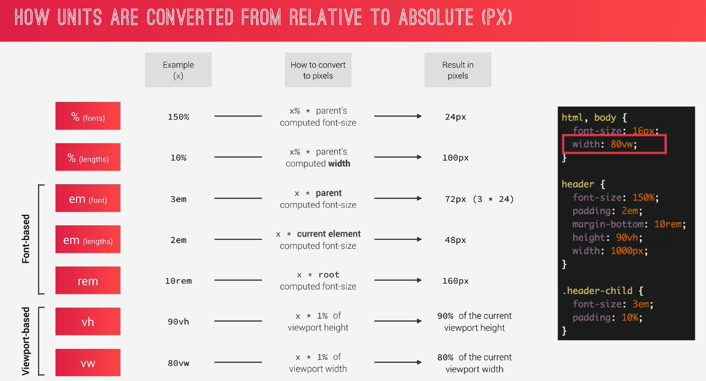
 
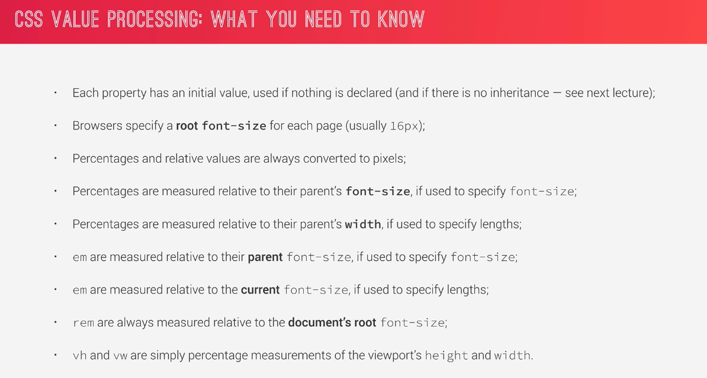

### Inherit
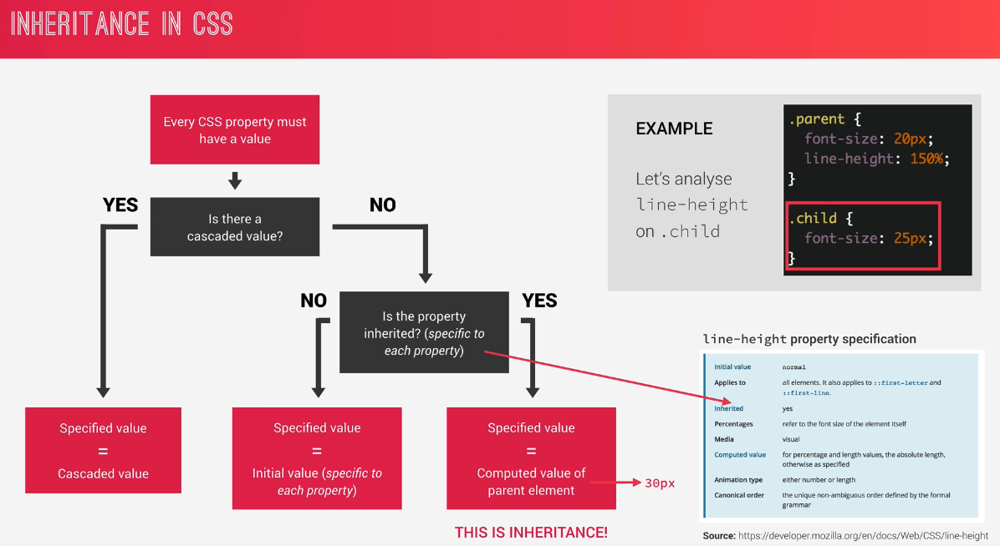
- 모든 것이 inherit 되지는 않는다. specification에서 확인이 필요함
- text와 관련된 것은 inherit 된다. 
- padding은 inherit 안된다.
- computed value로 inherit된다. (declared value로 inherit 되는게 아니다. 즉 이미지를 보면 line-height가 계산된 값인 30px이 inherit되는 것이지, 150%가 inherit되는 것이 아니다.)
- inherit value는 declared value가 있으면 적용되지 않는다.
- `inherit` keyword는 강제로 property를 inherit 한다.
- `initial` keyword는 initial value로 reset 한다.

## An Effective Workflow
### Converting px to rem
- px을 rem으로 모두 변경해줘서, responsive하게 만들 수 있다.
- tip으로는 아래와 같이 10px 단위로 해주면, class에서 rem 계산이 용이하다. 
  (단점은 사용자의 default font size를 고려하지 못한다는 것이다, 예를 들면 눈이 안 좋아서, 브라우저 default font size가 20px인 사람은 항상 크기를 조절해야하는 불편함을 겪는다.)
```css
html {
    font-size: 10px;
}
```
- 10px을 %로 바꿔주면, 사용자의 브라우저 default size에 맞춰줄 수 있으므로 더 좋다. 일반적 기본이 16px이기 때문에, 계산값으로 100/(10/16) = 62.5%로 나타내준다.
```css
html {
    font-size: 62.5%;
}
```
### Universal에서 inherit
- box-sizing의 경우 inherit이 되지 않으므로, 강제로 inherit을 부여해준다.
- univeral(`*`)의 경우 ::before, ::after에도 다 적용하도록 하자.
```css
*,
*::after,
*::before {
  margin: 0;
  padding: 0;
  box-sizing: inherit;
}
body {
  box-sizing: border-box;
}
```

## The Visual Formatting Model
### Dimensions of boxes: the box-model
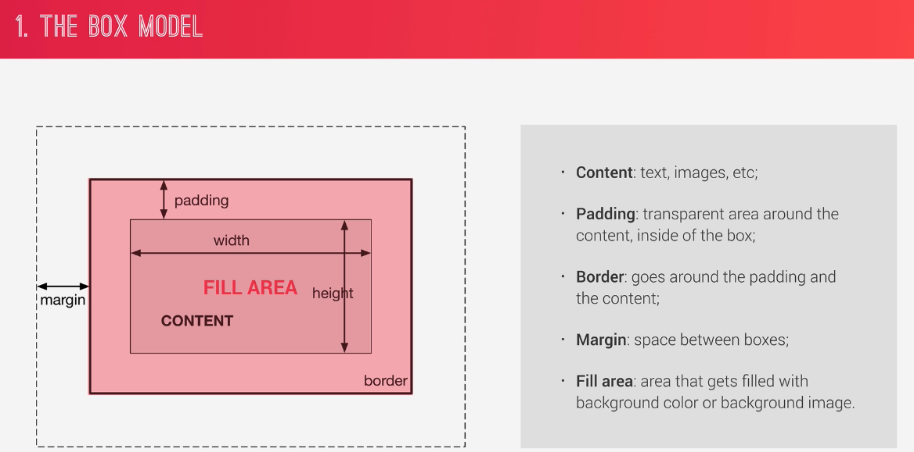
- box간에 거리를 두기 위해서는 `margin`을 쓴다.

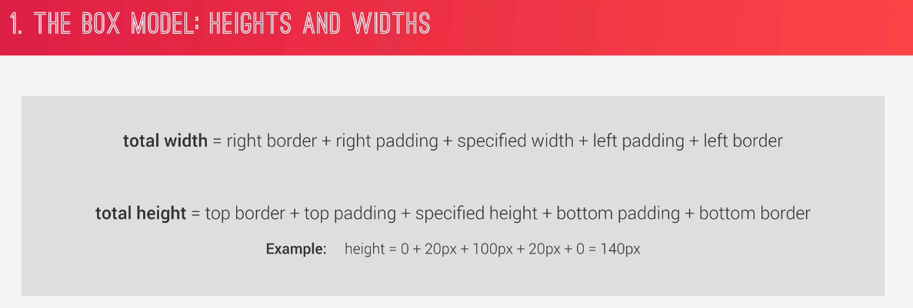
- `border-box`가 아닐때는 위와같이 계산이 복잡해진다.

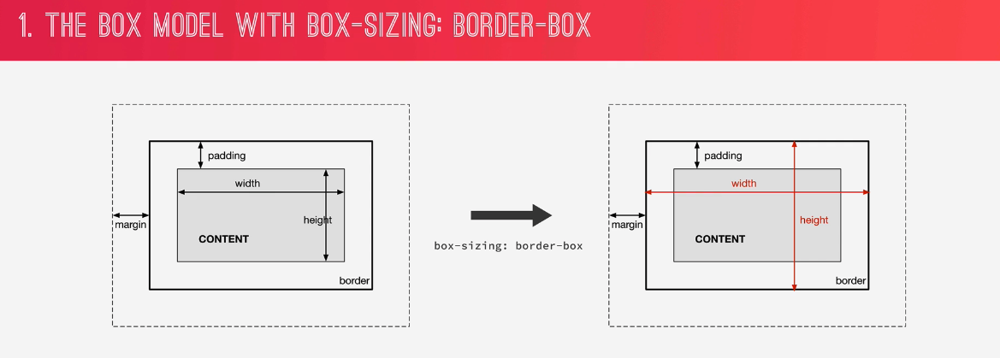
- `border-box`로 전체 width, height를 더 쉽게 예측할 수 있다.
### Box type: inline, block, and inline-block
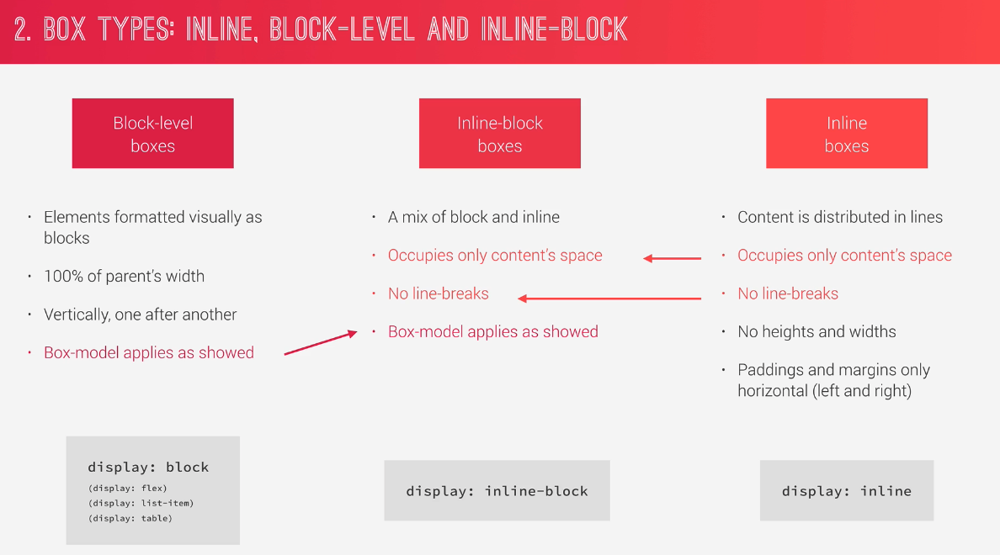
- `inline-block`의 경우 [위 사진](./img/box_model.png)에 있는 box-model 의 특징을 적용할 수 있고, inline의 특징을 동시에 갖는다.

### Position scheme: floats and position
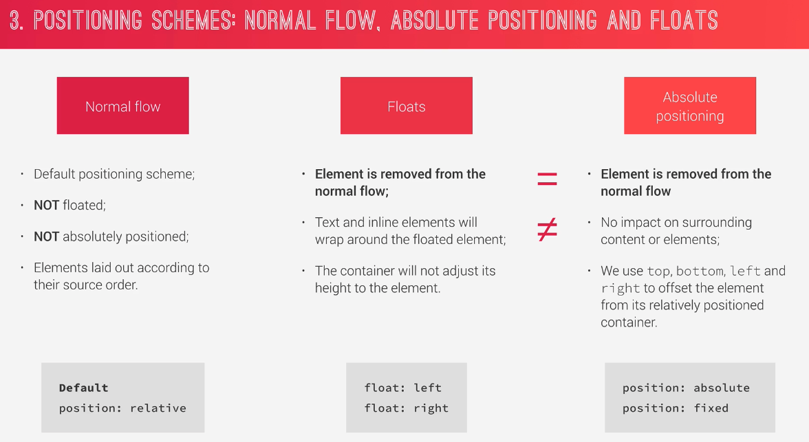
- `absolute`의 No impact는 overlap이 될 수 있음을 말한다.
### Stacking contexts
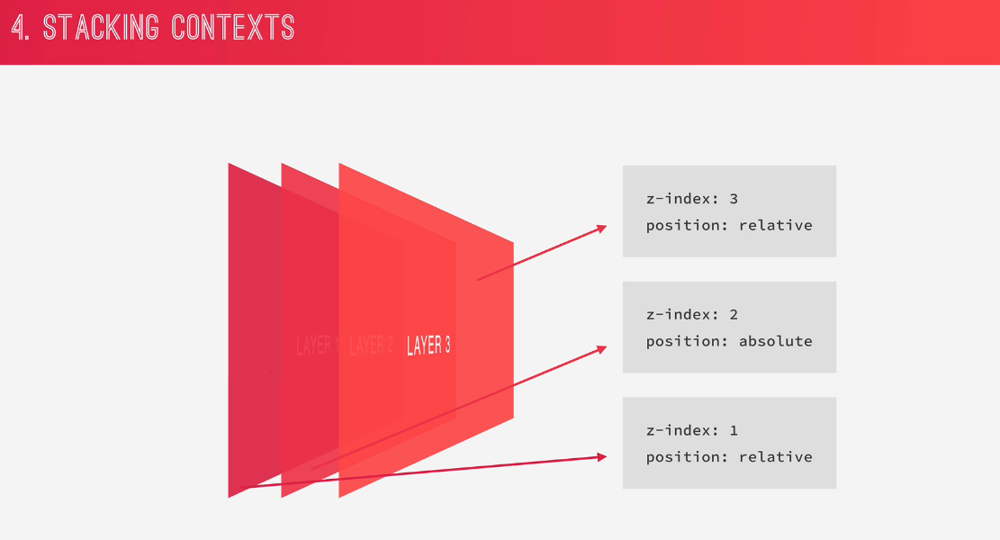
- stack을 쌓을 수 있는 것은 `z-index` 뿐만이 아니다. opacity, filter, transform, etc.. 과 같이 여러가지가 있기 때문에 `z-index`만으로 원하는 stack이 되지 않을 때가 있다.

## CSS Architecture
- Think => Build => Architecting 순으로 진행한다.

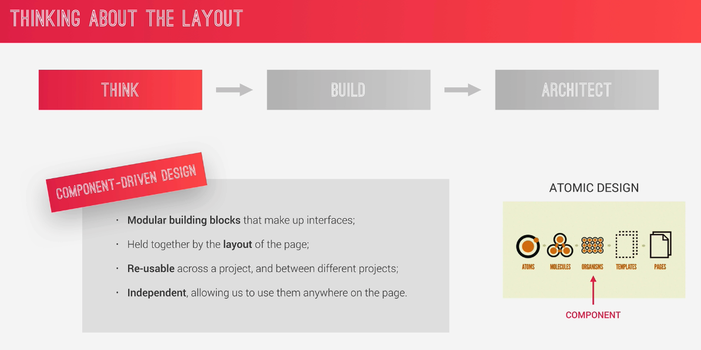
- Think에서 Component 단위로 구성을 한다.

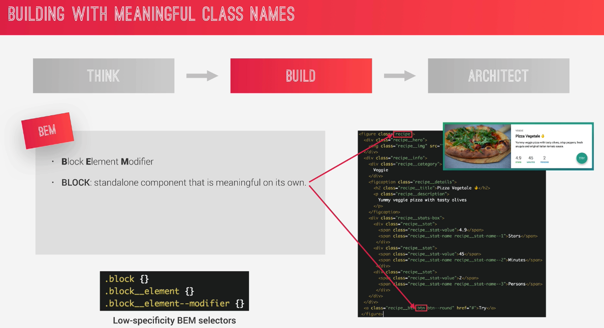
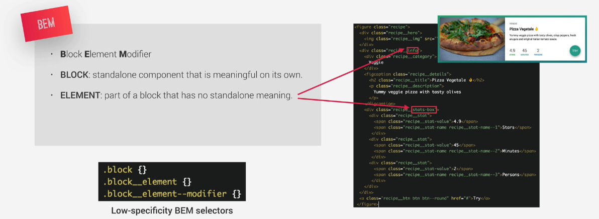
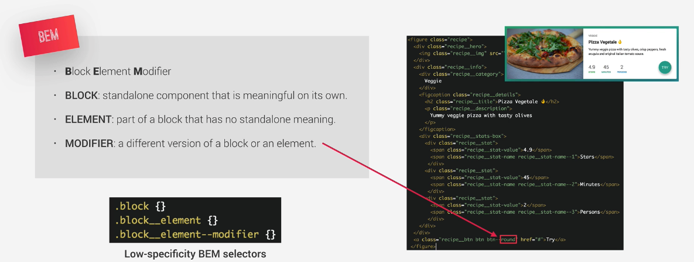
- Build에서는 BEM 방식을 쓰는데, element는 block과의 관계가 있어서 홀로 사용될 수 없는 경우, modifier는 block의 수정된 버전을 의미한다. block은 단독으로 어디서든 쓰일 수 있는 경우를 나타낸다.
  (Chrome에서는 `.block--modi`, `.block__element` 형태로 써도 문제가 없으나 Firefox에서는 안먹히는 듯 하다.)

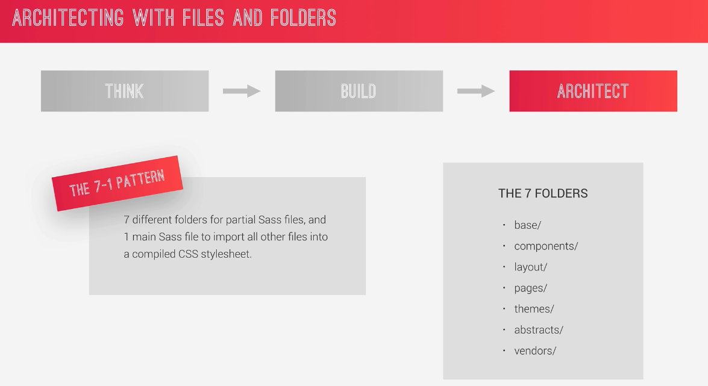
- Architecting 에서는 directory 구조를 만들고, 7-1 pattern을 적용해본다.