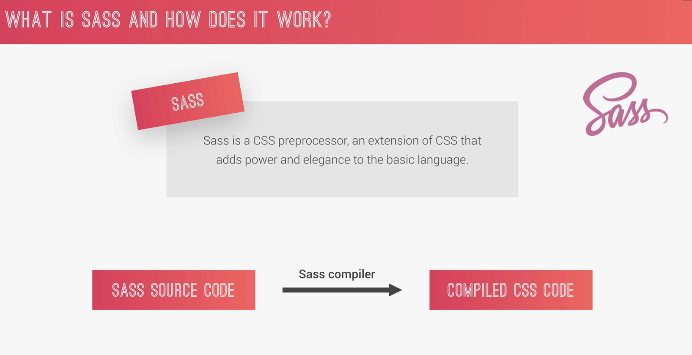
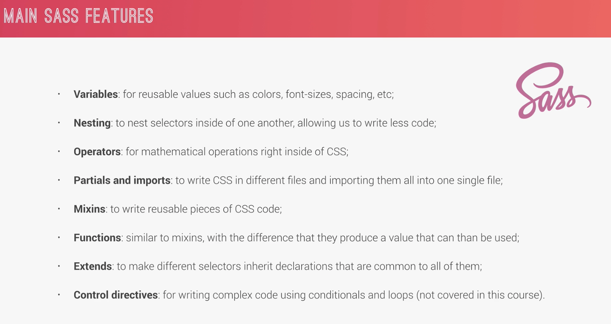
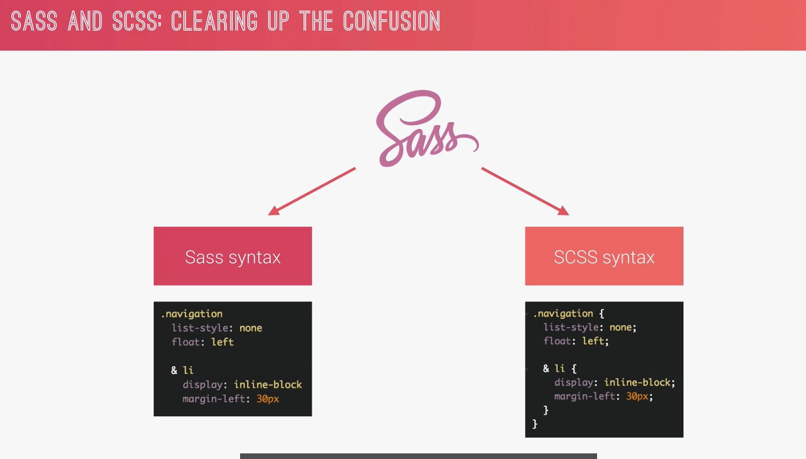

# Section 4

#### From CodePen
```html
<nav>
    <ul class="navigation">
        <li><a href="#">About us</a></li>
        <li><a href="#">Pricing</a></li>
        <li><a href="#">Contact</a></li>
    </ul>
    <div class="buttons">
        <a class="btn-main" href="#">Sign up</a>
        <a class="btn-hot" href="#">Get a quote</a>
    </div>
</nav>
```

```scss
* {
    margin: 0;
    padding: 0;
}
$color-primary: #f9ed69; // yellow color
$color-secondary: #f08a5d; // orange
$color-tertiary: #b83b5e; // pink
$color-text-dark: #333;
$color-text-light: #eee;

$width-button: 150px;

@mixin clearfix {
    &::after {
        content: "";
        clear: both;
        display: table;
    }
}
@mixin style-link-text($color) {
    text-decoration: none;
    text-transform: uppercase;
    color: $color;
}

@function divide($a, $b) {
    @return $a / $b;
}

nav {
    margin: divide(60, 2) * 1px; // 30px
    background-color: $color-primary;
    @include clearfix;
}

.navigation {
    list-style: none;
    float: left;
    li {
        display: inline-block;
        margin-left: 30px;

        &:first-child {
            margin: 0;
        }

        a:link {
            @include style-link-text($color-text-dark);
        }
    }
}

.buttons {
    float: right;
}

%btn-placeholder {
    padding: 10px;
    display: inline-block;
    text-align: center;
    border-radius: 100px;
    width: $width-button;
    @include style-link-text($color-text-light);
}

.btn-main {
    &:link {
        @extend %btn-placeholder;
        background-color: $color-secondary;
    }
    &:hover {
        background-color: darken($color-secondary, 15%);
    }
}

.btn-hot {
    &:link {
        @extend %btn-placeholder;
        background-color: $color-tertiary;
    }
    &:hover {
        background-color: lighten($color-tertiary, 10%);
    }
}
```

## What is Sass?



-   preprocessor



Sass VS Scss


