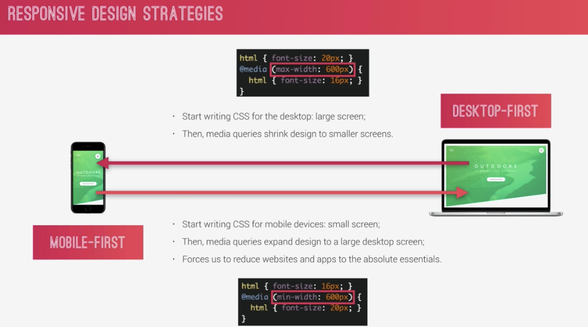
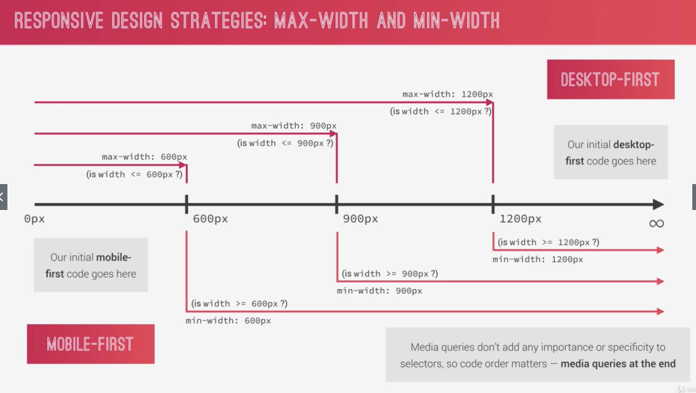
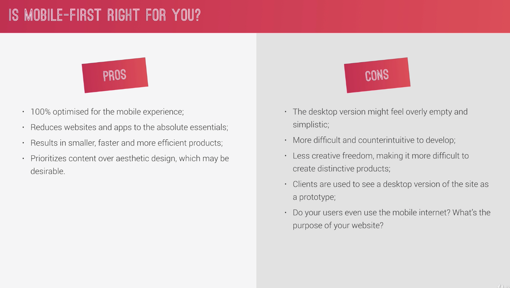
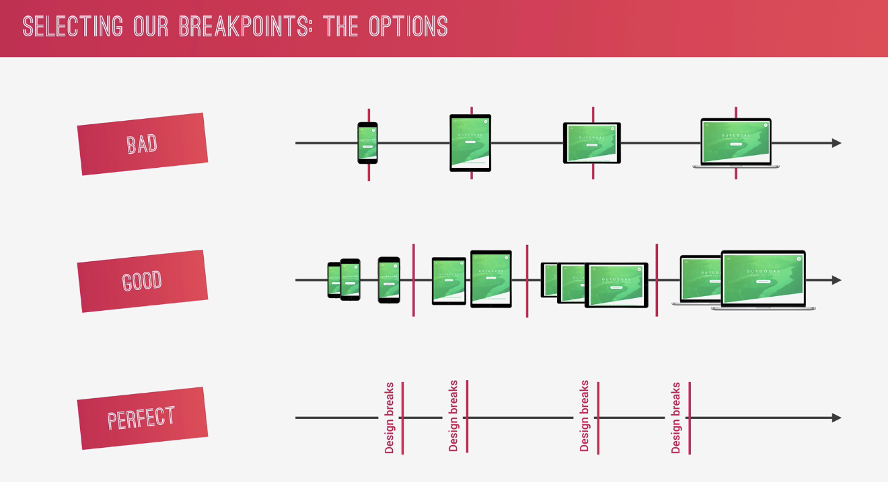
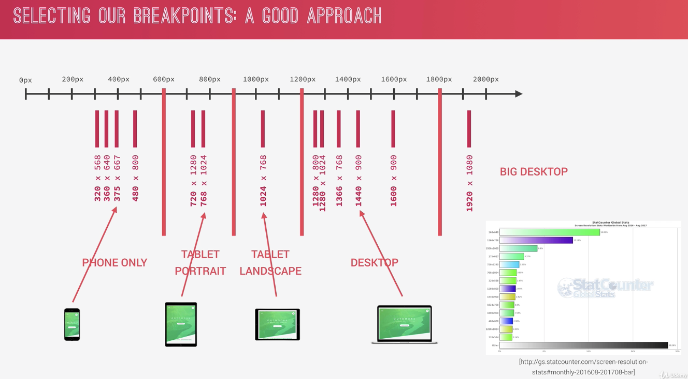

# Section 6

# Advanced Responsive design

## Responsive

### Mobile first or Desktop first

## Max-width and Min-width

-   미디어 쿼리 중복 적용 경우 생길 때는 > 코드 순서대로 적용된다. ( 뒤에 있는 것이 적용 된다 )

## Mobile first ( Pros and cons )

## Break point

### Bad

depends on Device

-   디바이스는 언제든 바뀔 수 있고, 너무 많아서 유지보수 너무 힘들다

### Good

인기있는 디바이스들과 같은 카테고리를 정해서 그룹화 하여 break

### Perfect

depends on Design, no Device
