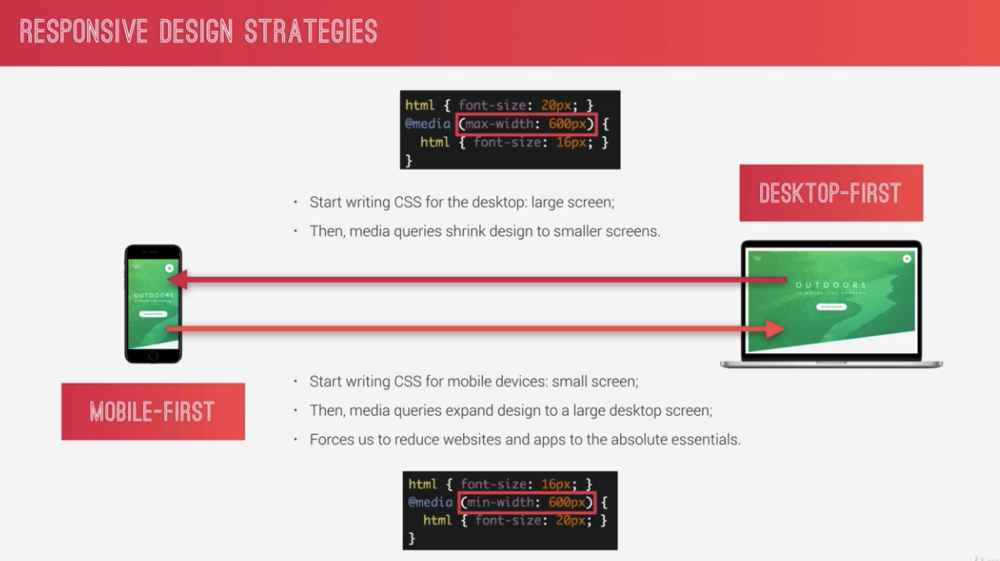
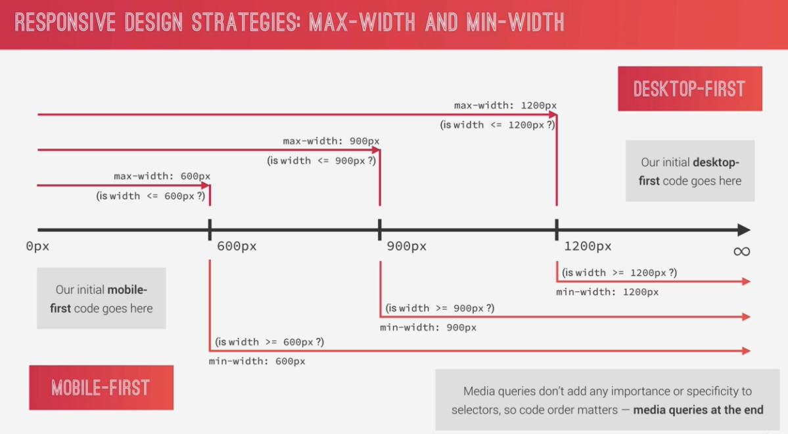
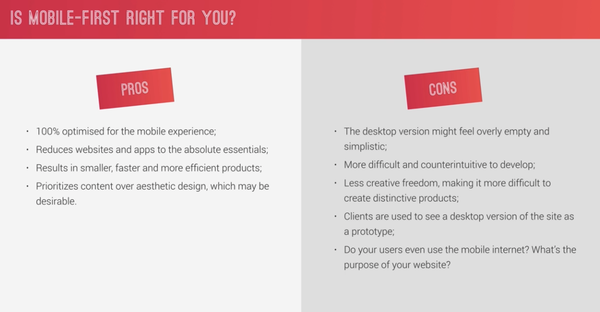
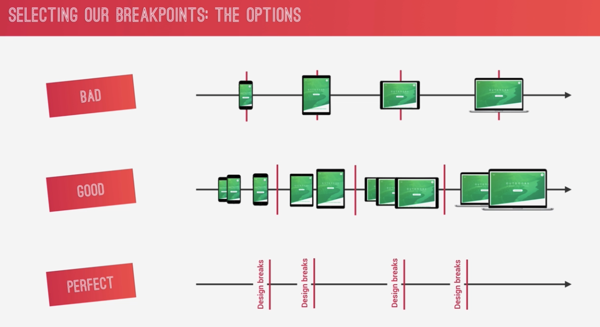
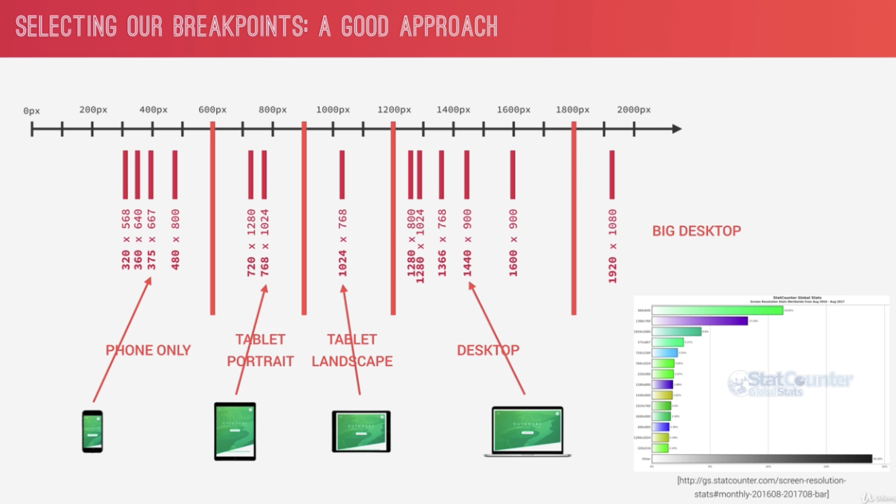

## Responsive Design


### desktop은 max기준, mobile은 min 기준으로 설계


### 모바일로 설계시작시 장단점


### breakpoints를 만드는 방식
breakpoint는 media 사이즈를 나누는 기준점 정도로 생각하면 된다.

- Bad: 가장안좋은 방법은 기기 자체를 breakpoint로 잡는 것이다.
- Good: 기기군을 나눠서 breakpoint로 생각한다.
- Perfect: 사이즈를 조절하다가 breakpoint로 필요하다고 생각되는 시점을 breakpoint로 잡는다.

### 디바이스별 breakpoints 기기군을 나눈다면 (2017년 자료)


## media query 에서 `mixin` 적용과 `em` 사용
- `rem`과 `px`의 경우 특정 브라우저에서 제대로 동작하지 않는다. (즉 정확한 시점에 동작하지 않음), 따라서 `em`을 쓴다.
- 반복적으로 사용하기 때문에, mixin으로 만들어준다. `@content` 부분이 여기(`@include name(arg){ 여기 }`)부분에 들어가는 것이다.
- 브라우저의 width에 따라 font-size (rem으로 사용하는 사이즈) 가 바뀌도록 해준다.
```scss
// 1em = 16px
@mixin respond($breakpoint) {
    @if $breakpoint == big-desktop { @media (min-width: 112.5em) { @content; }; }   // above 1800px
    @if $breakpoint == tab-land { @media (max-width: 75em) { @content; }; }         // 1200px
    @if $breakpoint == tab-port { @media (max-width: 56.25em) { @content; }; }      // 900px
    @if $breakpoint == phone { @media (max-width: 37.5em) { @content; }; }          // 600px
}
/* breakpoints
big-desktop : bigger than original
tab-land : tablet-landscape size
tab-port : tablet-portrait size
phone : mobile size
 */
```
```scss
html {
    // 이 부분은 font 자체보다는 rem 을 위한 setup
    font-size: 62.5%; // 1rem = 10px, 10/16 = 62.5%
    @include respond(big-desktop) { font-size: 75%; }   // 1rem = 9px, 9/16 = 50% 
    @include respond(tab-land) { font-size: 56.25%; }   // 1rem = 9px, 9/16 = 50%
    @include respond(tab-port) { font-size: 50%; }      // 1rem = 9px, 9/16 = 50%
    @include respond(phone) { font-size: 30%; }         // 1rem = 9px, 9/16 = 50%
}
```