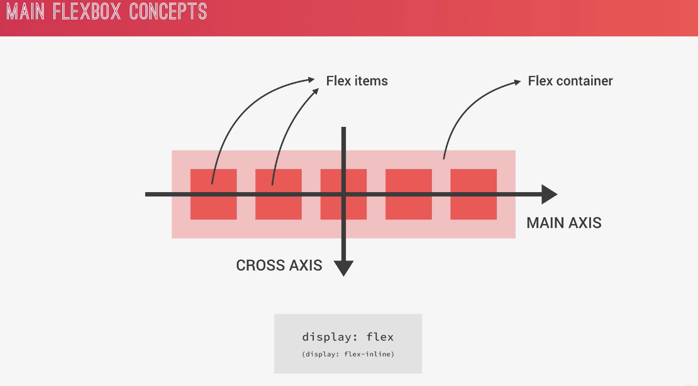
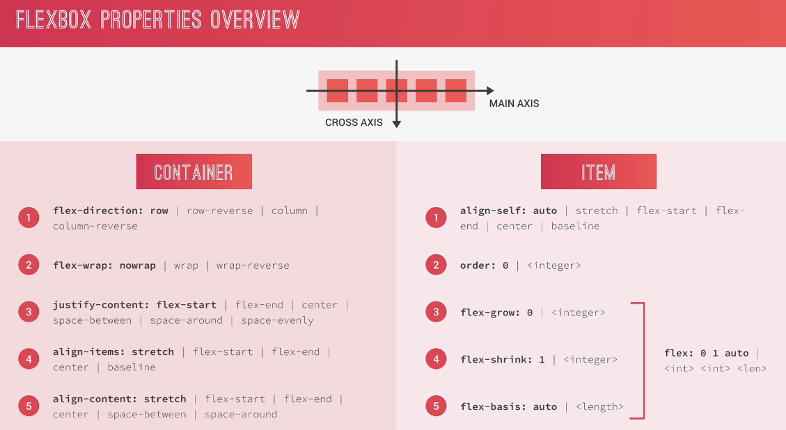
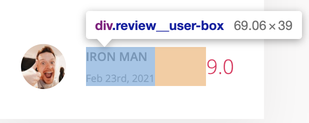

## Task
- Why to use SVG icons vs font icons
- How to find, generate and use SVG sprites in HTML
- How to change the color of an SVG icon in CSS
- How to use more advanced flexbox alignment techniques, including `justify-content`, `align-items` and `flex`
- How to use `scaleY` and multiple transition properties with different settings, to create a creative hover effect
- How and why to use the `currentColor` CSS variable
- How to use some more advanced flexbox alignment techniques, including `flex-direction`, `justify-content` and `align-items`
- How to create an infinite animation
- How to use `margin: auto` with flexbox, and why it's so powerful
- Continue to use flexbox properties for easy positioning and alignment
- Continue to use flexbox, including `flex-wrap` to build a multi-column list
- How and why to use CSS masks with `mask-image` and `mask-size`

## Flexbox

### Flex Container

- main axis와 cross axis를 잘 구분해야한다.
- justify-content: main axis에 따름
    - space-around: 각 flex-item의 좌우가 같다.
- align-item: cross axis에 따름
    - baseline: text의 위치를 기준으로 정렬하게 된다.
- flex-direction: column으로 바꾸면 main과 cross axis가 바뀐다. (justify-content가 세로축을 기준으로 적용되게 된다.)
- align-content: 여러 row가 생겼을 때 정렬하는 방법
- flex-wrap : container(display: flex)를 넘어갔을 때 container안에 wrap을 할건지
    - `flex-wrap: wrap`은 넘어가면 새로운 row로 내린다.
### Flex Item

- align-self: align-item으로 적용된 정렬을 무시하고, item 스스로 정렬할 수 있음
- order: 모든 item의 기본이 0이다, -1이면 가장앞으로 감
- flex-grow: 기본이 0, 남은 부분을 차지하는 비율을 말함 (상대적인 값이다.)
- flex-shrink: 기본이 1, 줄어들지 않게 하려면 0으로 하면 된다.
- flex-basis: flexbox에서는 width대신 flex-basis를 쓴다.
- shorthand: `flex: flex-grow flex-shrink flex-basis` 로 쓰는것이 best practice이다.

## CSS Variable
### CSS Variable 사용 이유
- pre-processor가 필요없다.
- javascript, devtools에서 edit이 가능하다.
- CSS variables는 cascade하고, inherit 된다.
- 사용법은 custom class를 만들어도 되지만, 아래로만 inherit되므로 global하게 쓰기 위해서 `:root` 아래에 넣는다.
  ```css
  :root {
    --color-primary: #eb2f64;
    --color-primary-light: #FF3366;
    --color-primary-dark: #BA265D;

    --color-grey-light-1: #faf9f9;
    --color-grey-light-2: #f4f2f2;
    --color-grey-light-3: #f0eeee;
    --color-grey-light-4: #ccc;

    --color-grey-dark-1: #333;
    --color-grey-dark-2: #777;
    --color-grey-dark-3: #999;
  }
  ```

## SVG
### SVG icon website
- icomoon.io 에 많이 있음
- sprite: svg 파일을 한곳에서 사용할 수 있도록 한 파일로 모은 것
- use를 사용해서 svg를 만들면 svg에 색상을 줄 수 있다.
- 색상은 `fill`을 사용하면 된다.
```html
<nav class="user-nav">
  <div class="user-nav__icon-box">
    <svg class="user-nav__icon">
      <use xlink:href="img/sprite.svg#icon-bookmark"></use>
    </svg>
    <span class="user-nav__notification">7</span>
  </div>
  <div class="user-nav__icon-box">
    <svg class="user-nav__icon">
      <use xlink:href="img/sprite.svg#icon-chat"></use>
    </svg>
    <span class="user-nav__notification">13</span>
  </div>
  <div class="user-nav__user">
    
    <span class="user-nav__user-name">Stefan</span>
  </div>
</nav>
```

## Layout
- Header (상단 위치)
```scss
.header {
  font-size: 1.4rem; // header default font size
  height: 7rem;
  background-color: #fff;
  border-bottom: var(--color-grey-light-2);

  display: flex;
  justify-content: space-between; // 상단 navigation을 왼, 가운데, 우측에 각각 위치 시킴
  align-items: center; // cross axis 중앙 정렬
}
```
- Header아래, 왼쪽 Sidebar
```scss
.sidebar {
  background-color: var(--color-grey-dark-1);

  flex: 0 0 18%; // grow, shrink없고 Header의 18% 차지하도록
}
```
- Header아래, 오른쪽에 위치한 메인 컨텐츠
```scss
.hotel-view {
  background-color: #fff;

  flex: 1; // 남은 부분 차지할 수 있는 최대한 차지하도록
}
```

## 검색 form 
### 검색 form Styling
```scss
.search {
  flex: 0 0 40%; // 검색 창 사이즈를 전체의 40%로 한다.
  display: flex;
  align-items: center;
  justify-content: center;

  &__input {
    font-family: inherit; //inherit 되지 않는 property는 `inherit` 값을 적용해준다.
    font-size: inherit;
    color: inherit;
    background-color: var(--color-grey-light-2);
    border: none;
    padding: .7rem 2rem;
    border-radius: 100px;
    width: 90%;
    transition: all .2s;
    margin-right: -3.5rem; //검색 박스안에 돋보기 아이콘 넣는 방법: 검색박스의 margin-right를 (-)값으로 해준다.

    &:focus {
      outline: none; // focus 될때 outline 잡히는 것 제거
      width: 100%;
      background-color: var(--color-grey-light-3);
    }

    &::-webkit-input-placeholder {
      font-weight: 100;
      color: var(--color-grey-light-4);
    }
  }
    
  &__button {
    border: none;
    background-color: var(--color-grey-light-2);

    &:focus {
      outline: none; // focus 될때 outline 잡히는 것 제거
    }
    &:active {
      transform: translateY(2px); // 돋보기 버튼 눌렀을 때 push되는 효과
    }
  }
```

## Side Navigation
- 마우스를 올렸을 때, 왼쪽에서 오른쪽으로 primary-color가 덮히는, animation 효과가 있는 사이드 bar이다.
- `currentColor`로 현재 class의 `color`혹은 parent의 color를 받을 수 있다.
- `z-index`는 `position`이 정의되어있는 곳에서만 효력이 있다.
```scss
.sidebar {
  display: flex;
  flex-direction: column;
  justify-content: space-between;
}
```
```scss
.side-nav {
  font-size: 1.4rem;
  list-style: none;
  margin-top: 3.5rem;

  &__item {
    position: relative;
    margin-bottom: .5rem;

    &:last-child {
      margin-bottom: 0;
    }
  }

  &__item::before {
    content: '';
    position: absolute;
    top: 0;
    left: 0;
    height: 100%;
    width: 3px;
    background-color: var(--color-primary);
    transform: scaleY(0);
    transform-origin: top;
    transition:
            transform .2s,
            width .4s cubic-bezier(1, 0, 0, 1) .2s,
            background-color .1s;
  }

  &__item:hover::before,
  &__item--active::before {
    transform: scaleY(1);
    width: 100%;
  }

  &__item:active::before {
    background-color: var(--color-primary-light);
  }

  &__link {
    color: var(--color-grey-light-1);
    text-decoration: none;
    text-transform: uppercase;
    padding: 1.5rem 3rem;
    position: relative; // z-index only works if we have specified position
    z-index: 10;

    display: flex;
    align-items: center;
  }

  &__icon {
    width: 1.75rem;
    height: 1.75rem;
    margin-right: 2rem;
    fill: currentColor; // 현재 color이거나, parent color를 따른다.
  }
}
```

## list style 만들기
### list 앞에 붙는 > 모양 svg에 색깔 주기
- mask로 svg부분만 background-color가 보이게하고, 나머지는 흰색으로 가려지게 하는 방법이다.
```scss
&__item::before {
  content: '';
  display: inline-block;
  height: 1rem;
  width: 1rem;
  margin-right: .7rem;
    
  // Newer browsers - mask
  background-color: var(--color-primary);
  -webkit-mask-image: url(../img/chevron-thin-right.svg);
  -webkit-mask-size: cover; // behave like background-size so it resize svg
  mask-image: url(../img/chevron-thin-right.svg);
  mask-size: cover; // behave like background-size so it resize svg
}
```

## margin auto 활용하여 여백주기
### margin auto를 활용하여 여백을 주는 방법 (space-between과 유사한 형태)
- margin-right: auto를 주면 아래와 같은 형태가 된다. (user-name, user-date는 아래코드에서 생략함)
  - `margin-right: auto`가 잡혀서 `.review__rating`과 `.review__user-box`사이에 남은 flex가 자동으로 채워지는 것을 알 수 있음
  
```html
<figcaption class="review__user">
  
  <div class="review__user-box">
    <p class="review__user-name">Susan</p>
    <p class="review__user-date">March 20rd, 2021</p>
  </div>
  <div class="review__rating">9.0</div>
</figcaption>
```
```scss
review {
  &__photo {
    height: 4.5rem;
    width: 4.5rem;
    border-radius: 50%;
    margin-right: 2rem;
  }

  &__user-box {
    margin-right: auto;
  }

  &__rating {
    font-size: 2rem;
    font-weight: 300;
    color: var(--color-primary);
  }
  
}
```

## `last-of-type` vs `last-child`
### last-of-type
- `:last-of-type`은 같은 element를 잡을 때 쓸 수 있다. `:last-child`와 용도가 비슷한 pseudo class이다.

## Media Query
### media query 사이즈 변수로 지정하기
- 아래와 같이 max-width를 변수로 만들어서 적용할 수 있음
```scss
$bp-largest: 75em; //break-point, 1200px
$bp-large: 68.75em; //break-point, 1100px
$bp-medium: 56.25em; //break-point, 900px

html {
  box-sizing: border-box;
  font-size: 62.5%; // 10px

  @media only screen and (max-width: $bp-large) {
    font-size: 50%; // large size에서는 default 글자크기를 8px로 줄임 (16*.5px)
  }
}
```