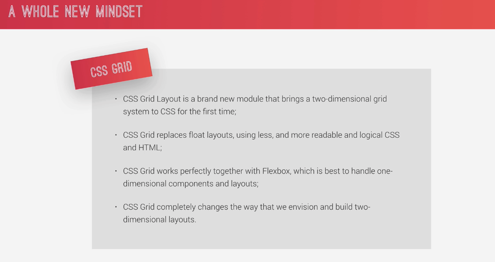
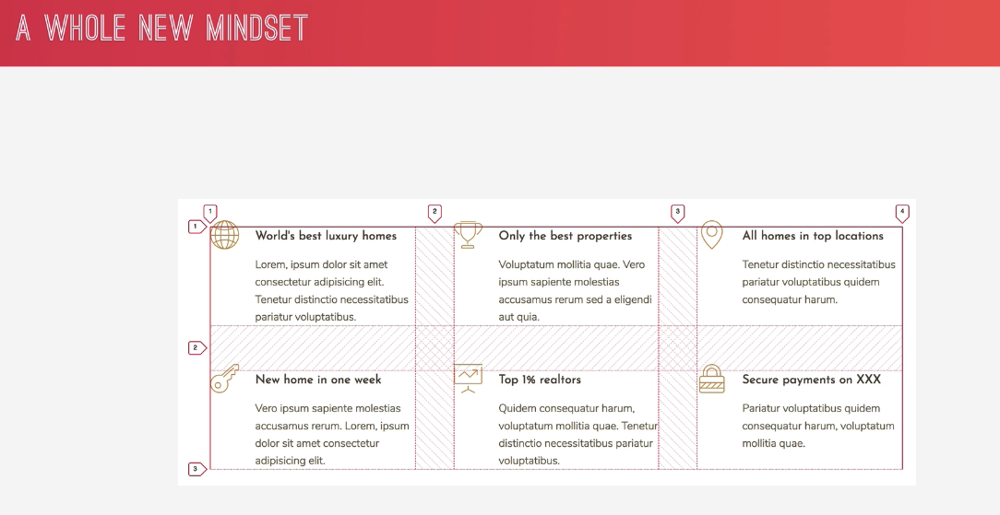
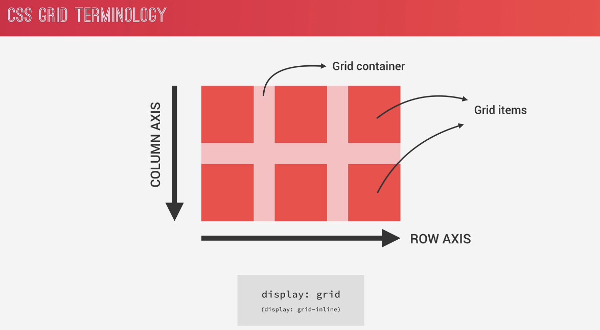
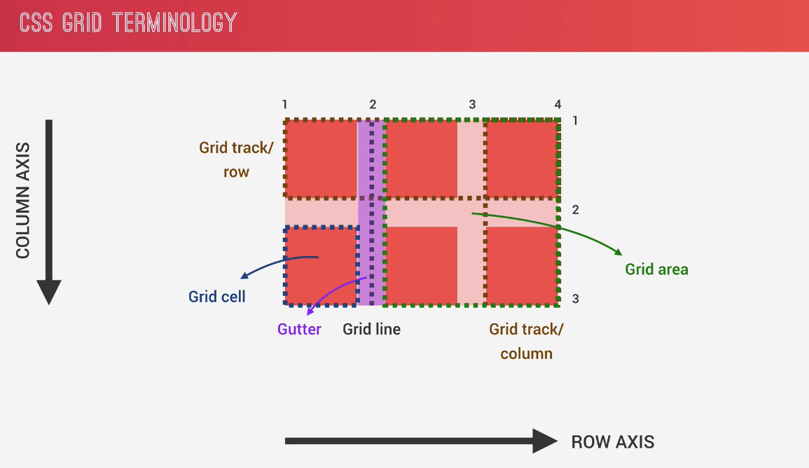
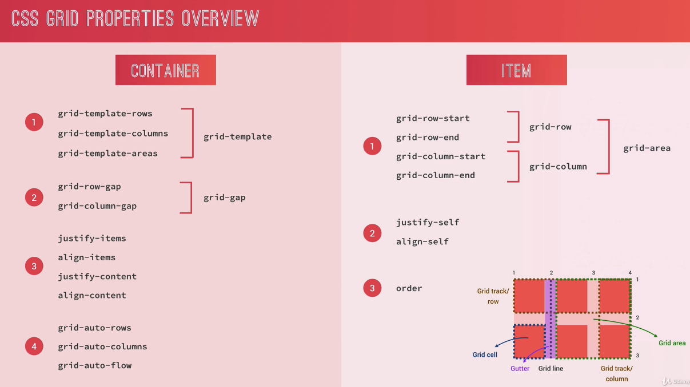

## Grid Test
### [codepen](https://codepen.io/stefan-cho/pen/rNWJovz) 으로 간단 예제

  See the Pen <a href="https://codepen.io/stefan-cho/pen/rNWJovz">
  grid</a> by stefan-CHO (<a href="https://codepen.io/stefan-cho">@stefan-cho</a>)
  on <a href="https://codepen.io">CodePen</a>.

