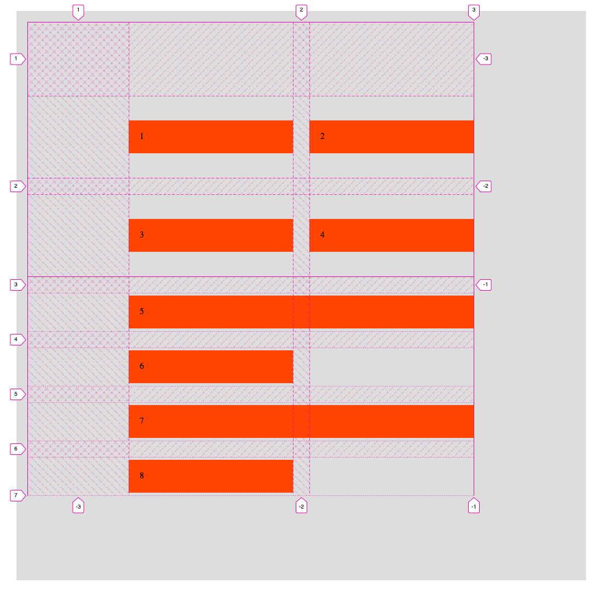
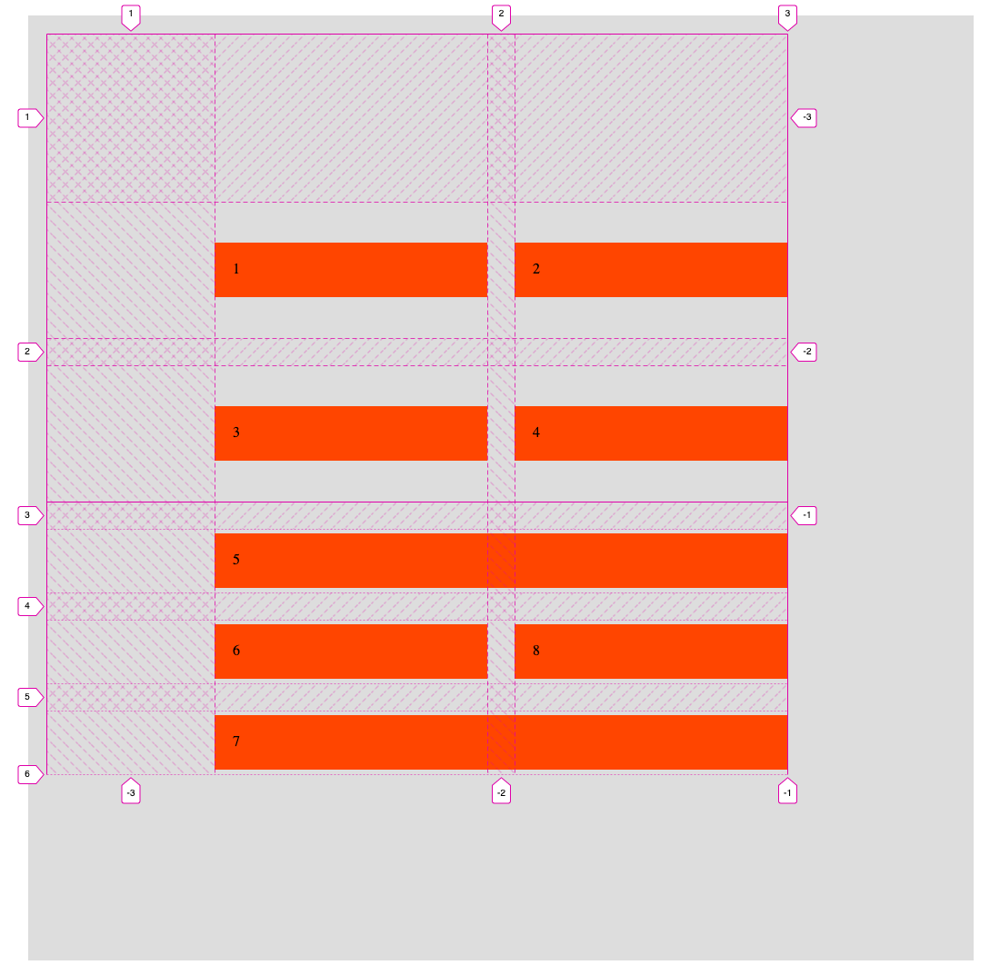
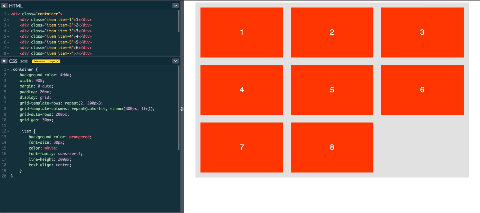

## Grid Test
### [codepen](https://codepen.io/stefan-cho/pen/rNWJovz) 으로 간단 예제
<p class="codepen" data-height="265" data-theme-id="dark" data-default-tab="css,result" data-user="stefan-cho" data-slug-hash="rNWJovz" style="height: 265px; box-sizing: border-box; display: flex; align-items: center; justify-content: center; border: 2px solid; margin: 1em 0; padding: 1em;" data-pen-title="grid">
  <span>See the Pen <a href="https://codepen.io/stefan-cho/pen/rNWJovz">
  grid</a> by stefan-CHO (<a href="https://codepen.io/stefan-cho">@stefan-cho</a>)
  on <a href="https://codepen.io">CodePen</a>.</span>
</p>
<script async src="https://cpwebassets.codepen.io/assets/embed/ei.js"></script>

### Grid Properties
- fr : felxbox의 flex: 1과 비슷하다. (남은 공간을 차지하는 비율)
- percentage : `grid-template-column: 50% 150px 1fr`일때, 퍼센트는 gap 상관없이 전체를 기준으로 사이즈를 정한다.
- 아래코드는 property에 대한 단순예시이다.
- grid는 서로 겹칠 수 있다. 즉 item-1과 item-2의 grid-row, grid-column 부분이 동일하거나 일부 겹치게 되어도 상관없다. 이때는 z-index로 forward 혹은 backward 한다.
```scss
.container {
    display: grid;
    width: 1000px;
    height: 1000px;
    
    grid-gap: 30px 60px; //grid-row-gap과 grid-column-gap을 한번에
    grid-template-rows: repeat(3, 1fr); // 동등하게 3개로 나눔, repeat은 내부값을 단순 반복을 해준다.
    grid-template-columns: 50% 1fr 1fr; // 50%는 500px을 먹는다.
}
.item-1 {
    grid-row-start: 1;
    grid-row-end: 2;
    grid-row: 1 / 2; // 위 두개와 같다, column도 같은 방식
    grid-column: 3 / 4;
    grid-area: 1 / 3 / 2 / 4; //두개를 섞어 쓸 수 있다, row-start | column-start | row-end | column-end, 헷갈리므로 비추천
}
.item-2 {
    grid-row: 1 / span 2; // 1 / 2와 같다. span은 갯수를 의미
    grid-column: 1 / -1; //만약 끝까지 늘리려면 minus값으로 하는게 낫다.
}
```
## Grid Challenge
### Grid result
- [codepen](https://codepen.io/stefan-cho/pen/gOLemEV)


- 결과
<p class="codepen" data-height="265" data-theme-id="dark" data-default-tab="html,result" data-user="stefan-cho" data-slug-hash="gOLemEV" style="height: 265px; box-sizing: border-box; display: flex; align-items: center; justify-content: center; border: 2px solid; margin: 1em 0; padding: 1em;" data-pen-title="grid-challenge">
  <span>See the Pen <a href="https://codepen.io/stefan-cho/pen/gOLemEV">
  grid-challenge</a> by stefan-CHO (<a href="https://codepen.io/stefan-cho">@stefan-cho</a>)
  on <a href="https://codepen.io">CodePen</a>.</span>
</p>
<script async src="https://cpwebassets.codepen.io/assets/embed/ei.js"></script>

### Naming Grid Lines
- [codepen](https://codepen.io/stefan-cho/pen/yLVKwdm)
- 각 grid에 이름을 붙일 수 있다.
  - repeat의 앞뒤로 이름을 붙이면, 아래 예시에서는 `col-start 1`, `col-end 1`, `col-start 2`... 와 같은 형태로 사용할 수 있다.
  ```scss
  .main {
    display: grid;
    grid-template-columns: [main-start] repeat(3, [col-start] 1fr [col-end]) [main-end] 20% [grid-end];
    grid-template-rows: [box-start sidebar-start] 40% [box-end main-start] 1fr [main-end sidebar-end];
  }
  ```

### Naming Grid Areas
- [codepen](https://codepen.io/stefan-cho/pen/qBqoveR)
- grid-template-areas에 이름을 붙일 수 있다. __(주의: grid의 이름이 누락되면 안된다. dot(.)이라도 써줘야함.)__
  - 사용하지 않는 곳 (empty space가 되길 원하는 곳)은 dot(.)을 써준다. (아래 예시)
    ```scss
    grid-template-areas:
    'box box box .'
    'main main main side';
    ```
  - matrix가 4X4, 5X5와 같이 작은 경우에 사용하면 좋다.
  ```scss
  .main {
    background-color: #eee;
    grid-column: 1 / -1;
    display: grid;
    grid-template-columns: repeat(3, 1fr) 20%;
    grid-template-rows: 40% 1fr;
    grid-template-areas:
    'box box box side'
    'main main main side';
    grid-gap: 20px;

    & > * {
      background-color: orangered;
    }
    .sidebar {
      grid-area: side;
    }
    .main-content {
      grid-area: main;
    }
  }
  ```
  
## Implicit vs Explicit Grid
- [codepen](https://codepen.io/stefan-cho/pen/QWGBwmY)
- 명시하지 않은 grid의 경우, `grid-auto-flow`, `grid-auto-columns`, `grid-auto-rows`로 사이즈 및 생성방향을 정해줄 수 있다.
  - 아래는 Firefox 개발자 도구이다. (예제는 위 codepen)
    - 주황색부분(점선) : implicit grid
    - 노란색부분(실선 및 dash선) : explicit grid


## Aligning
- [codepen](https://codepen.io/stefan-cho/pen/wvoxaWb?editors=1100)
### align items
- 아래 코드에서 `justify-items` 와 `align-items` 부분이다. grid 내에 있는 각 item들에 대해서 정렬하는 방식이다. 기본값은 stretch 이다.
### align tracks
- container내에서 grid 전체를 맞출 때 쓴다. `justify-content` 와 `align-content` 이다. (아래 이미지에서는 쏠리는 가이드 점선이 쏠리는 것처럼 나왔는데 상관없음)
### dense
- `grid-auto-flow`에서 끝에 dense를 써주면, 아래 두번째 이미지처럼 꽉 채우게 된다. (grid의 기본 알고리즘이 최대한 순서에 맞추도록 되어있기 때문에, 빈공간이 발생할 수 있는 데 그곳을 메워줄 때 쓴다.)
```scss
.container {
    width: 1000px;
    height: 1000px;
    padding: 20px;
    margin: 30px auto;
    background-color: #ddd;
    
    display: grid;
    grid-template-rows: repeat(2, 150px);
    grid-template-columns: repeat(2, 300px);
    grid-gap: 30px;
    
    grid-auto-rows: 70px;
    grid-auto-flow: row dense;

    justify-content: center;
    align-content: center;
    
    justify-items: stretch;
    align-items: center;
    
    .item {
        padding: 20px;
        background-color: orangered;
        
        &--5 {
            grid-column: 1/-1;
        }
        &--7 {
            grid-column: 1/-1;
        }
    }
}
```
- 기본상태
  
- dense 적용 시
  
  
## Using min-content, max-content, minmax, auto-fill, auto-fit
- `min-content` : content의 최소 사이즈에 맞춤
- `max-content` : content의 최대 사이즈에 맞춤
- `minmax({min값}, {max값})` : 항상 min값과 max값 사이값 (즉 min보다 작으면 min값, max보다 크면 max값)
- `auto-fill` : 자동으로 계산하여 나눔 (height 1000px을 100px로 `repeat(auto-fill, 100px)` 하면 100px의 column 10개 생김)
- `auto-fit` : available space에 맞춤 (`repeat(auto-fit, minmax(100px, 1fr))`이면 사이즈가 줄어들면 grid를 추가로 만듦, empty column(혹은 row) must not occupy any space)
  - auto-fill와 비교하면 auto-fit의 경우도 column이 10개 생기지만, content가 없는 column의 경우 0px의 사이즈가 된다.
  - auto-fit은 media query 없이도 responsive 디자인이 가능하게 한다. (이 때 width, height는 %로 잡아줘야한다. fix 된 px사이즈로 잡으면, 브라우저 사이즈 상관없이 minmax사이즈가 정해지기 때문에)
  
- [codepen](https://codepen.io/stefan-cho/pen/jOVvrLB)
  
  
