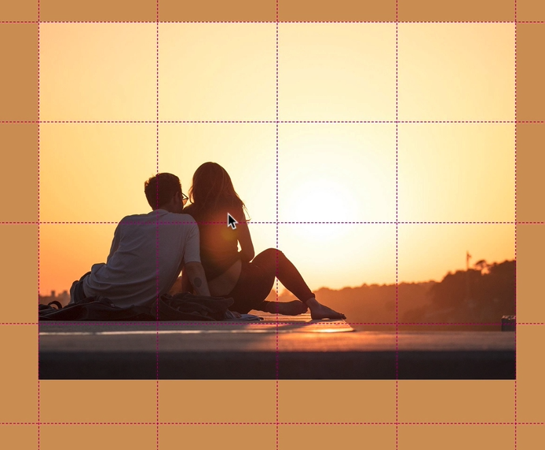
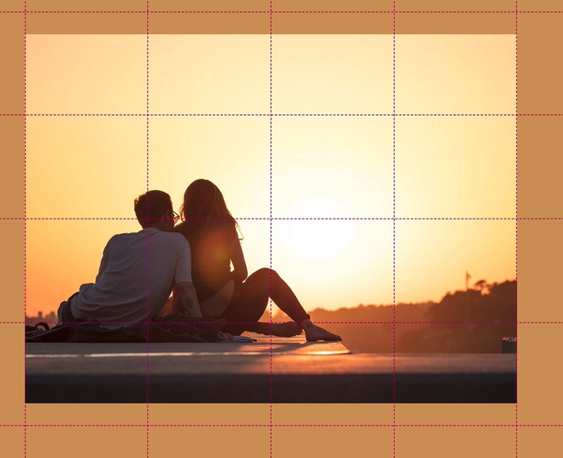

## Task
- How to build a complex and modern layout using advanced CSS Grid techniques
- How to choose different row and column track sizes for different types of content
- How and why to create girds inside of grids
- How to create a responsive component without media queries
- How to build a small component using CSS grid
- How to deal with overlapping grid items
- Why images are special and behave differently than other grid items
- How to decide if flexbox is a better tool in certain situations
- How to build a rather complex component using a mix of CSS Grid properties, overlapping and flexbox
- How to create a complex grid-looking gallery
- Using `object-fit` together with images for grid items

## grid-template
### min-content
- `grid-template-rows`(혹은 columns)의 사이즈를 정확히 모를 때 사용 (적어도 content 크기만큼 갖도록 하는 것)

## Full-bleed layout
- content column을 3개로 만들고, middle column에 content를 넣고, 필요한 경우 양쪽 column으로 확장시키는 방식
- 양쪽에 1fr (1 fraction of the remaining space) 값을 준다. (아래 code에서 `minmax(6rem, 1fr)` 부분)
    - minmax로 6rem을 적용하는 이유(min값을 적용하는 이유)는, 좌우의 마진이 있는 형태가 디자인이 더 괜찮기 때문이다.
```scss
.container {
    grid-template-columns:
        [sidebar-start] 8rem [sidebar-end full-start] minmax(6rem, 1fr) [center-start]
        repeat(8, [col-start] minmax(min-content, 14rem) [col-end])
        [center-end] minmax(6rem, 1fr) [full-end];
}
```

## Explicit Grid
### `grid-row: 1 / -1;`의 의미
- `-1`은 explicit grid의 가장 끝 부분을 의미한다.
- auto로 생성된 implicit grid가 끝에 있다면 -1로 잡을 수 없다. `span {숫자}` 혹은 `{숫자}`로 정해줘야 auto로 생성된 끝에 있는 implicit grid를 잡을 수 있다.

## Responsive Grid
### media query 없이 responsive grid 만들기
- `grid-template-columns: repeat(auto-fit, minmax(25rem, 1fr));`와 같이 auto-fit 과 minmax의 조합으로 만들 수 있다.

## Grid vs Flexbox
- 1 dimension 이라면 flexbox가 유리하다. (아래 Flexbox과 Grid방식을 비교해보자. 결과는 같다.)
```scss
.story {
  &__pictures {
    background-color: $color-primary;
    grid-column: full-start / col-end 4;
  }

  &__content {
    background-color: $color-grey-light-1;
    grid-column: col-start 5 / full-end;

    padding: 6rem 8vw;

    // Flexbox 방식
    display: flex;
    flex-direction: column;
    justify-content: center;
    align-items: flex-start;

    // Grid 방식
    display: grid;
    align-content: center;
    justify-items: start;
  }

  &__text {
    font-size: 1.5rem;
    font-style: italic;
    margin-bottom: 4rem;
  }
}
```
## Image in Grid
### Image가 grid 내에서 center 되도록
- image는 비율때문에 grid를 채우지 못할 수 있다. 따라서 중간정렬을 해줘야한다.
- `align-items: center;` grid area에서 center 되도록
  - before

  - after

    
### image overlay
- image를 background로 쓸때, 자연스러움을 줄 수 있다.
- `background-image: linear-gradient(rgba($color-primary, .5), rgba($color-primary, .5)), url(../img/back.jpg);` overlay 효과

  
## Card 만들기
- _home.scss의 `.home`을 참고

## Gallery 만들기
### `object-fit` & `figure`
- `figure` element에 `grid-row`, `grid-column`을 줘서 grid 배치를 한다. (img는 figure내부에서 100% `object-fit: cover`되도록 한다.)
- `object-fit`은 `width`, `height` 둘다 값을 지정해야 적용된다. (아래에는 둘다 100%로 지정)
- image는 inline으로 적용되서, 끝부분에 공간이 뜨는 경우가 있으므로, `display: block`을 해줌
```html
<figure class="gallery__item gallery__item--1">
  
</figure>
```
```scss
// code location : _gallery.scss
&__img {
  width: 100%;
  height: 100%;
  object-fit: cover;
  display: block;
}
```

