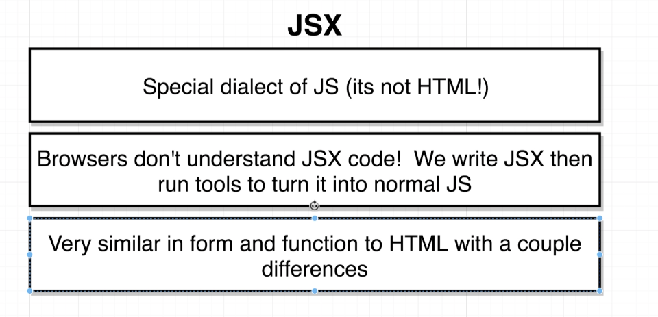
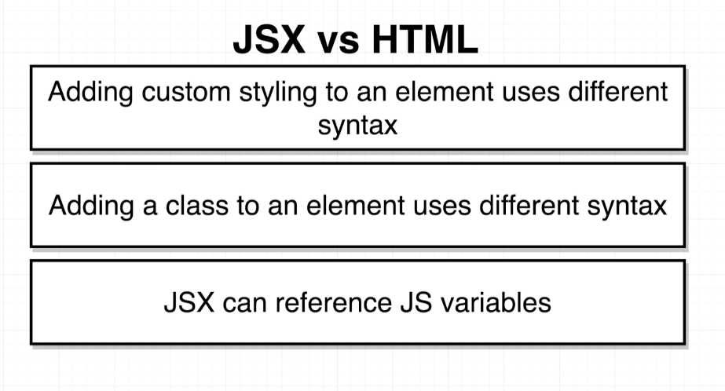
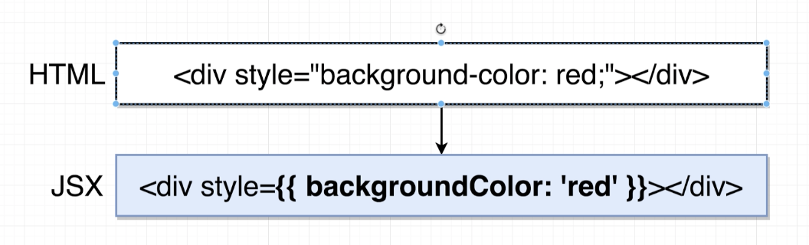

# Building Content with JSX

- Link
  - Babel : https://babekjs.io

## What is JSX?

It's not HTML at all

- jsx → [babel] → normal javascript
- jsx can makes more readable, understandable

## Converting HTML to JSX

## Inline Styling with JSX

### in JSX,

- first {} : means, it's indicate JS variable
- second {} : means, JS Object

### Convention

double quotes : in JSX all of string use double quotes.

single quote : non-JSX e.g) 

## class VS className

`class App extends React.Component` VS `<label className= "label" />`

- JSX 에서는 JS class 와 혼동 되지 않게 하려고 className이라고 쓴다.

## Values JSX Can't Show

- JS Object can't be react child
