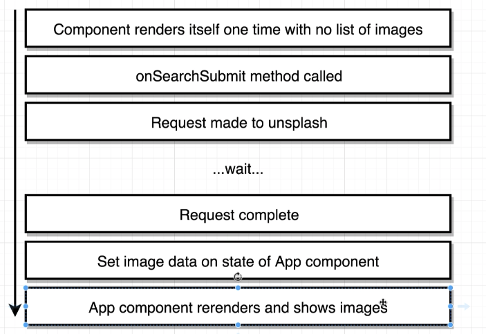

> section8 이전 커밋내용은 [여기](https://github.com/devstefancho/udemy-modern-react/tree/master) 의 브랜치 확인, 시간될때 노션에 기록한 내용 옮길예정

## unsplash.com에서 fetch
- API : https://unsplash.com/documentation#schema
- Search(path와 params) : https://unsplash.com/documentation#search
- Auth(headers에 추가) : https://unsplash.com/documentation#public-authentication
```javascript
        axios.get('https://api.unsplash.com/search/photos', {
            params: {
                query: item
            },
            headers: {
                Authorization: `Client-ID ${env.ACC_KEY}`
            }
        })
```

## Rendering process


## default state 값
### default state 값을 정확한 type으로 써줘야 하는 이유
예를 들어 아래와 같은 코드가 있다고 가정했을 때, initial값이 array가 아닌 것 때문에, TypeError가 발생할 수 있다.
```javascript
class App extends React.Component {
    state = { image: null }
    //(...)
    componentDidUpdate() {
        this.state.map( v => v)
    }
    //(...)
    render() {
        return <div>{this.state.image.length}</div>
    }
}
```
따라서 `state = { image: [] }` 이렇게 타입을 정확히 정의해주도록 하자.

## axios
### [axios.create](https://github.com/axios/axios#axioscreateconfig)
axios의 instance를 만든다.
- axios.create([config])
```javascript
const api = axios.create({
  baseURL: 'https://some-domain.com/api',
  timeout: 1000,
  headers: {'X-Custom-Header': 'foobar'}
});

api.get('/search/photos', { params: { query: 'item' }, })
    .then((res) => res)
```