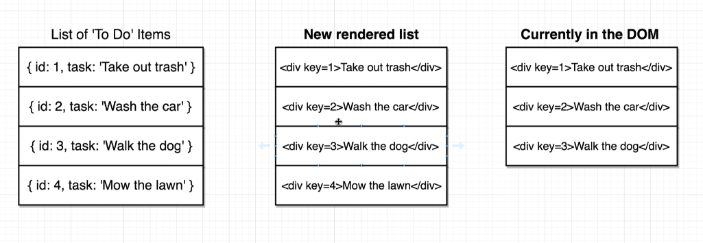

## Component Key
### key가 필요한 이유
- react는 DOM을 업데이트 할 때 key를 먼저 비교하고 key가 일치하면, 내용이 같은지 비교한다.
- key가 없어도 error는 아니지만, performance에 영향이 있다.
- root element에만 추가하면 된다. 아래 코드와 같이 가장 상위 element인 div에만 key를 주면 된다.
```javascript
images.map( image => (
    <div key={image.id}>
        
    </div>
))
```
아래와 같이 destructuring 해주면 더 깔끔하다.
```javascript
images.map(({id, description, url}) => (
    <div key={id}>
        
    </div>
))
```
