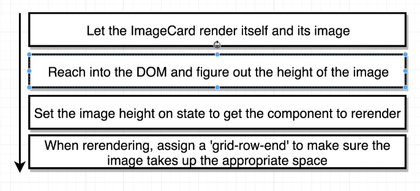

## ImageList Grid 만들기
### grid 방식
- repeat은 grid의 반복을 의미한다. auto-fill은 자동으로 columns의 갯수를 계산한다. min이 250이고, max가 1fr이다. (fr은 상대값)
- grid-auto-rows로 각 줄의 높이를 정한다. 그리고 grid-row-end를 span 2로 하여 이미지 하나당 2줄씩 차지하도록 한다.
```css
.image-list {
    display: grid;
    grid-template-columns: repeat(auto-fill, minmax(250px, 1fr));
    grid-gap: 10px;
    grid-auto-rows: 150px;
}

.image-list img {
    width: 250px;
    grid-row-end: span 2;
}
```

## React Refs
### DOM element의 값에 직접 접근하는 방법 (vanilla js)
```javascript
let imgHeight = document.querySelector('img').clientHeight;
```
### React에서는 Ref을 만들어서 접근한다.
- Gives access to a single DOM element
- We create refs in the constructor, assign them to instance variables, then pass to a particular JSX element as props
- JSX에서 DOM으로 바뀌게 되는데, 이때 JSX에 의해 만들어진 DOM (정확히는 특정 element) 을 handle 할 수 있는 방법이 Refs 이다.
```javascript
constructor(props) {
    super(props);
    this.imageRef = React.createRef();
}
// (...)
    
// (...)
```
### Image Ref의 clientHeight가 0이 나오는 이유

- ImageCard가 랜더링 된 후에 componentDidMount에서 아래와 같이 접근하면, clientHeight가 0이 나온다. 
- 이유는 Image를 서버에 request하고 response가 아직 도착하지 않은 상태여서(JSX를 랜더링한 직 후라 너무 빨라서) image element는 있지만 사이즈가 default 값인 0이 나오는 것이다.

```javascript
    componentDidMount() {
    console.log(Object.assign({}, this.imageRef)); // 정상값으로 다 나옴 (이유는 shallow copy라서 object 주소값을 그대로 들고 있음)
    console.log(Object.assign({}, this.imageRef.current)); // img의 주소만 있고, 사이즈 값 없음 (아직 response 도착하지 않음)
    console.log(this.imageRef.current.clientHeight); // 0
}

render() {
    const { description, urls } = this.props.image;
    return (
        
    )
}
}
```
### load가 되었을 때 callback을 실행한다.
```javascript
    componentDidMount() {
        this.imageRef.current.addEventListener('load', this.setSpans.bind(this));
    }

    setSpans() {
        console.log(this.imageRef.current.clientHeight);
    }
```
- load가 되었을 때, `setSpan`을 실행한다. callback은 `this`를 잃기 때문에, `bind`를 해주거나 `setSpan`을 arrow function으로 써준다.

### span state를 만들고 계산 값을 각 이미지에 넣는다.
```javascript
    setSpans() {
        const height = this.imageRef.current.clientHeight
        const spans = Math.ceil(height / 10);
        this.setState({spans})
    }
```
- 나누는 값(grid-auto-rows)의 값은 정교할 수록 좋다. 대신 이때는 row간의 gap 값을 없애줘야한다. (각 row마다 gap이 붙으므로)