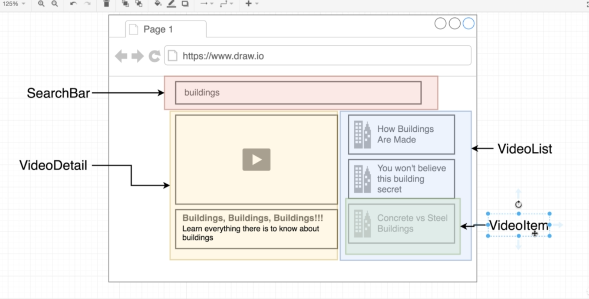
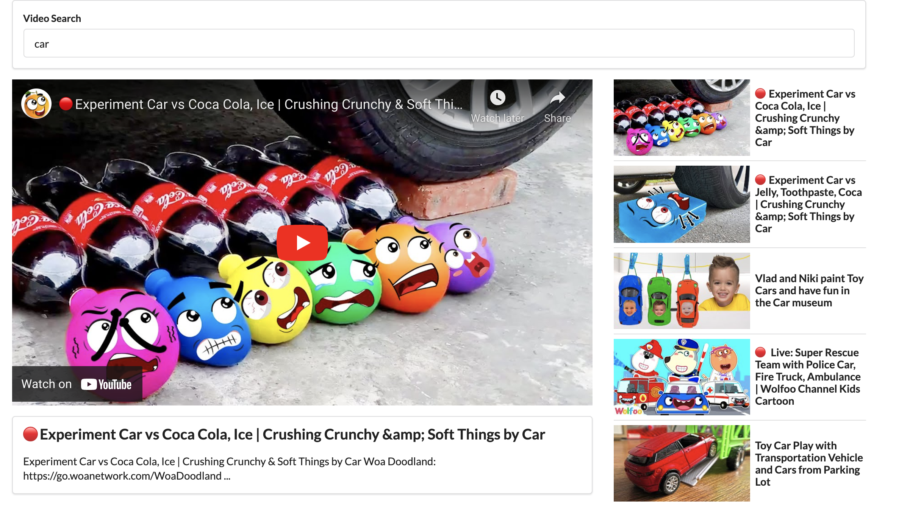

## Youtube API
### Setup
1. console.developers.google.com
2. New Project 생성
3. YouTube Data API v3 검색해서 enable 시킴
4. Credentials => create credentials
5. restriction API key 만들어서 HTTP => localhost:3000으로 등록

### Youtube API 사용법
youtube api search(google 검색) : https://developers.google.com/youtube/v3/docs/search/list#request

## Structure
### Video Structure
- List 아래에 Item이 있는 구조

  
### Detail segment
- material ui의 segment를 활용한다.

### Iframe
- Iframe is going to attempt to make a request to some outside Website besides the one that the user is currently visiting on the screen
- Iframe은 현재 web site의 내부에 다른 website를 embed할때 쓴다. 즉 youtube 영상을 embed할 수 있음.
    - youtube > share > embed를 보면 iframe형식인 것을 확인할 수 있다.
```js
<div className="ui embed">
    <iframe title="video player" src={`https://www.youtube.com/embed/${video.id.videoId}`} frameborder="0" allowFullScreen></iframe>
</div>
```

## Result
