## Hooks System
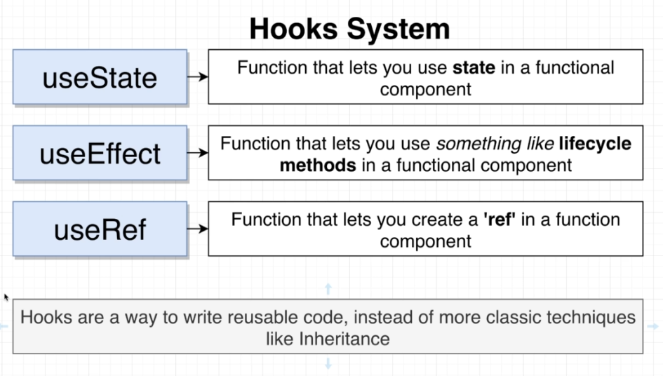
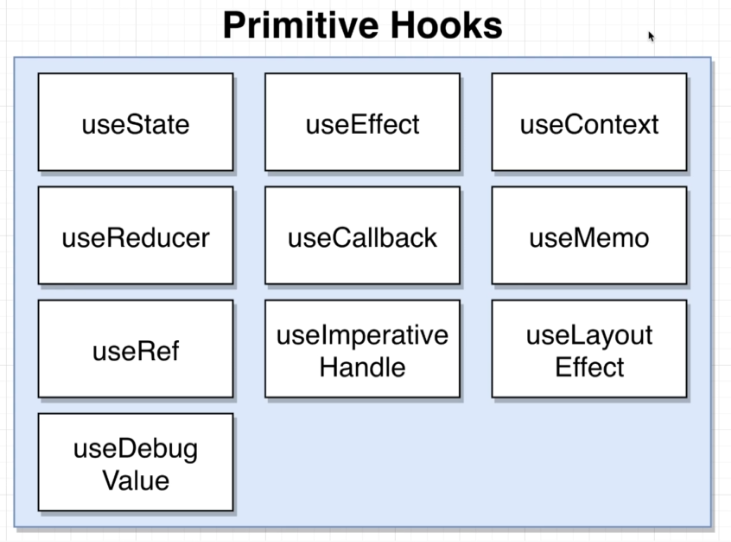
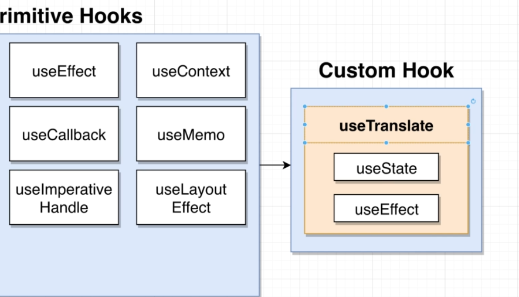
### Functional Component의 단점
- helper functions를 organize하는데에 class components보다 좋지 않다.
- 아래 두가지를 비교해보면 helper function이 많아지면, class에서 정리가 더 수월(깔끔)함을 알 수 있음
```js
const Accordion = () => {
    const onTitleClick = () => {
        console.log('clicked');
    }
    
    return ( <div onClick={() => {onTitleClick()}}>Click!</div> )
}
```
```js
class Accordion extends React.Component {
    onTitleClick() {
        console.log('clicked');
    }

    render() {
        return ( <div onClick={() => {onTitleClick()}}>Click!</div> )
    }
}
```
### useState
- useState는 array의 destructuring 형태이다.
- setState 처럼 한번에 여러 state를 set할 수 없다. (state마다 useState를 call 해줘야함)
- useState로 state를 set할때마다 컴포넌트가 re-render된다. 이때 useState의 argument인 초기값은 적용되지 않는다. (최초 랜더링때만 초기값이 적용됨)
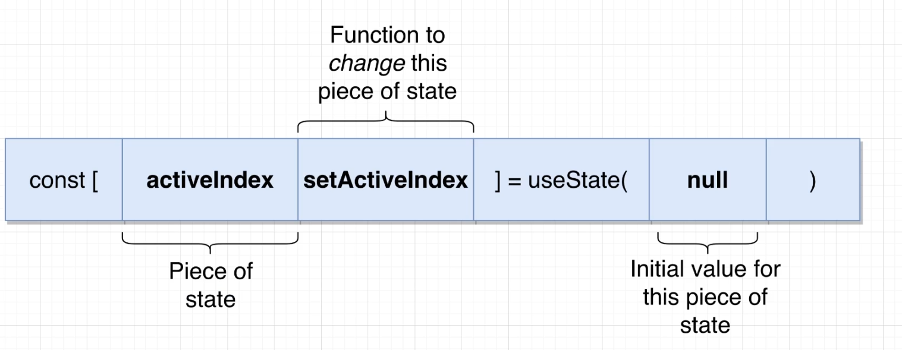
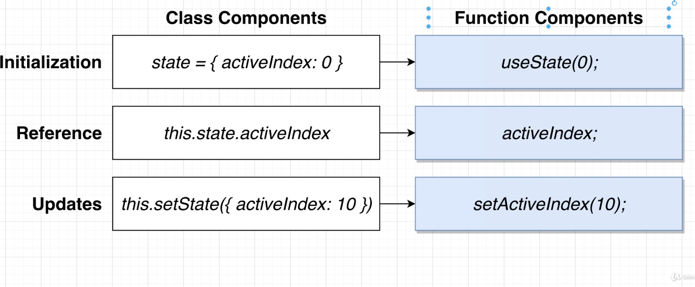
  
### useEffect
- callback function에 async를 직접 사용하지 못한다.
- 사용방법은 아래 3가지가 있다.
  - 권장 되는 방식 (helper function)
  ```js
  useEffect(() => {
      const search = async () => {
          await axios.get('url');
      }
      search();
  }, [])
  ```
  - helper function IIFE
  ```js
  useEffect(() => {
    (async () => {
      await axios.get('url');
    })();
  }, [])
  ```
  - axios의 promise를 이용하는 방식
  ```js
  useEffect(() => {
      axios.get('url')
              .then(() => {
                  console.log('promise')
              })
  }, [])
  ```
- something like life methods라고 설명되어 있다. 즉 life cycle methods는 아니고 유사한 방식이라는 것이다.
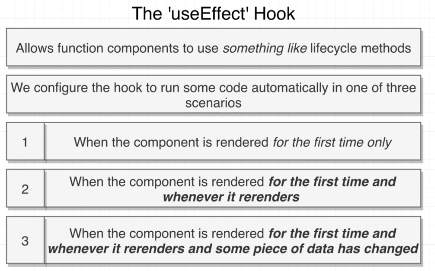
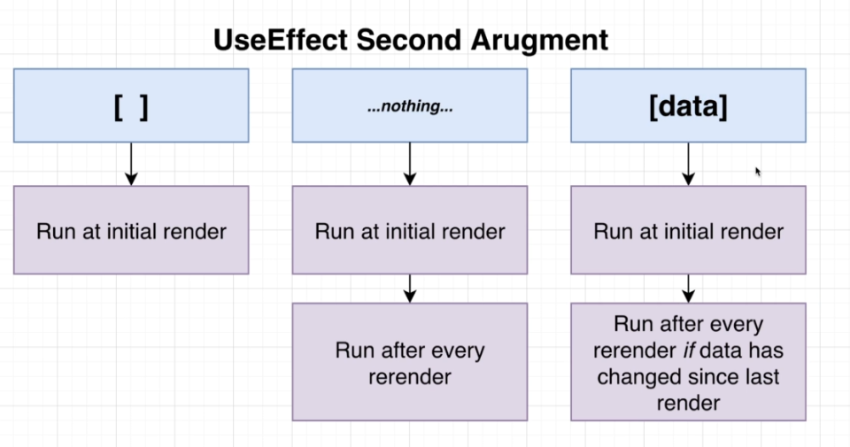
  
### useEffect로 Throttling
- 아래와 같이 throttling으로 이전 타이머를 취소한다. (아래그림)
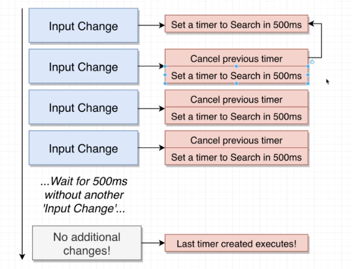
- setTimeout은 id가 있다, 이것을 clearTimeout으로 취소할 수 있다. (아래그림)
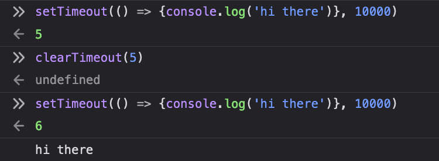
- useEffect의 return에는 function을 넣는다. 이것은 다음 useEffect에서 invoke된다. 이때 clearTimeout을 실행시켜준다. (아래그림)
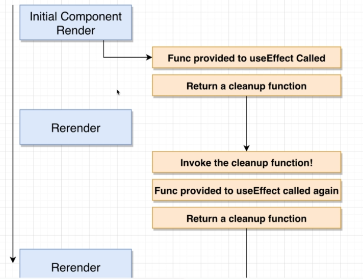
  
### debounce useEffect function 추가하기 (이유)
- 아래와 같이 warning이 발생하는 것은, useEffect안에 있는 모든 state, props를 dependency에 넣지 않았기 때문이다.
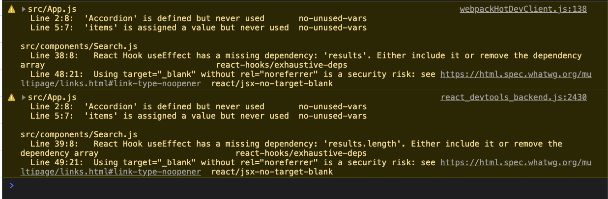
- warning을 없애기 위해서 deps에 `result.length`를 추가하니, api 호출이 한번더 발생한다. (re-render되었기 때문)
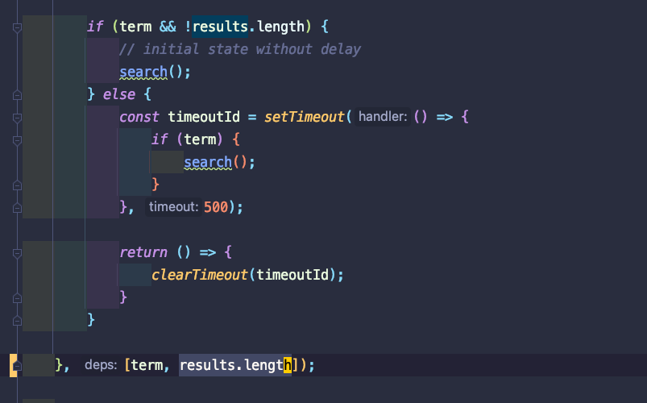
- 아래그림에서 최초 랜더링(새로고침)에서 똑같은 api가 두번 호출된 것을 확인할 수 있다.
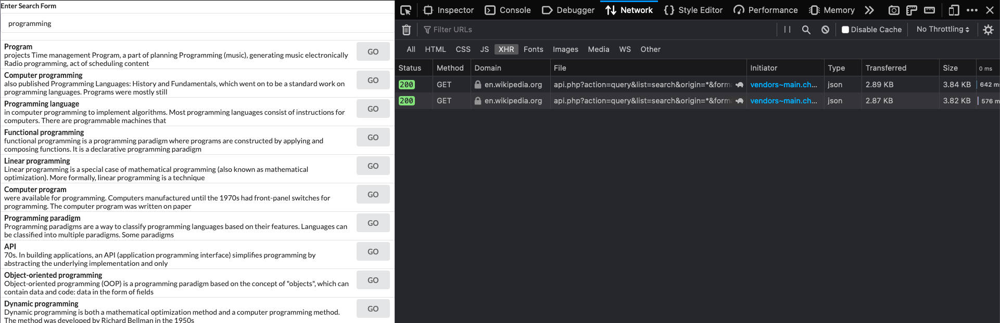
- 아래그림은 re-render된 이유이다.
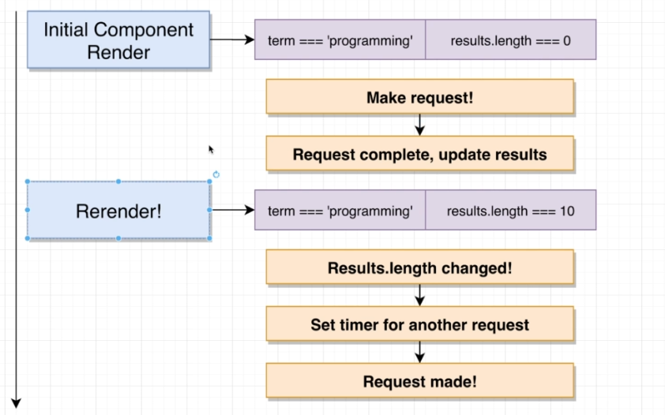
  
### debounce useEffect function 추가
- debounce용 useEffect를 하나 추가해서 위 현상을 해결한다. 
- debounce state용 useEffect는 term(입력값)의 변화에만 의존한다. 최종적으로 term변화가 일어났는지에 따라 search용 useEffect가 발생하게 된다.
  - debounce 적용된 경우, 빠르게(timeout 시간내에) input값을 지우고, 같은 input으로 검색하면 api를 호출하지 않는다. (term이 바뀌지 않았으므로)
- 아래 두 코드를 비교해본다. (첫번째는 debounce 적용하지 않음, 두번째는 debounce 적용)
```js
// 1. debounce 적용안한 코드 (warning 있음, api 두번호출함)
const [term, setTerm] = useState('programming');
const [results, setResults] = useState([]);

useEffect(() => {
  const search = async () => {
    const { data } = await axios.get('https://en.wikipedia.org/w/api.php', {
      params: {
        action: 'query',
        list: 'search',
        origin: '*',
        format: 'json',
        srsearch: term
      },
    });

    setResults(data.query.search);
  };

  if (term && !results.length) {
    // initial state without delay
    search();
  } else {
    const timeoutId = setTimeout(() => {
      if (term) {
        search();
      }
    }, 500);

    return () => {
      clearTimeout(timeoutId);
    }
  }

}, [term, results.length]);

```
```js
// 2. debounce용 useEffect 추가
const [term, setTerm] = useState('programming');
const [results, setResults] = useState([]);
const [debouncedTerm, setDebouncedTerm] = useState(term);

useEffect(() => {
  const timeoutId = setTimeout(() => {
    if (term) {
      setDebouncedTerm(term);
    }
  }, 500);

  return () => {
    clearTimeout(timeoutId);
  }
}, [term]);

useEffect(() => {
  const search = async () => {
    const { data } = await axios.get('https://en.wikipedia.org/w/api.php', {
      params: {
        action: 'query',
        list: 'search',
        origin: '*',
        format: 'json',
        srsearch: debouncedTerm
      },
    });

    setResults(data.query.search);
  };

  search();

}, [debouncedTerm]);
```
  
  
### dangerouslySetInnerHTML
- 다른 html을 jsx안에서 랜더링하고 싶을 때
- 갖고오는 html(아래에서는 result.snippet)이 100% 신뢰할만한 사이트의 html이 아니라면 XSS(Cross Site Scripting) attack을 받을 수 있으므로 상당히 위험하다.
```js
<span dangerouslySetInnerHTML={{ __html: result.snippet}}></span>
```

## cdnjs
- [cdnjs](https://cdnjs.com/) 에서 필요한 cdn url검색 (ex. semantic ui 검색)

## Accordion Widget
### state
- App에서 activeIndex props를 내려주는 것이 아니라, Accordion component가 본인의 activeIndex를 아는 것으로 설계
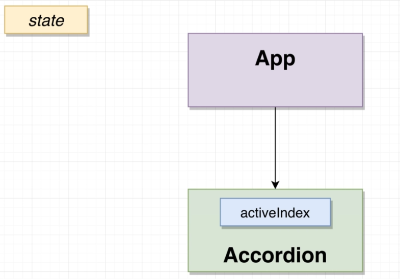
  
## Search Widget
### Wikipedia API
`en.wikipedia.org/w/api.php?action=query&list=search&format=json&srsearch=SEARCHTERM`
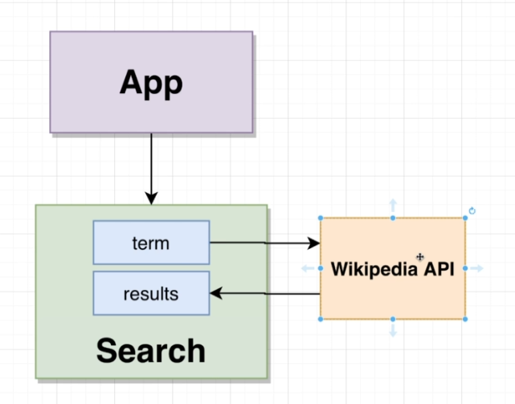
### Search할 수 있는 방법 
- 왼쪽은 타이핑하면서 바로 검색, 오른쪽은 state로 저장한 후에 검색하는 것으로 오른쪽이 더 좋은 방식이다.
  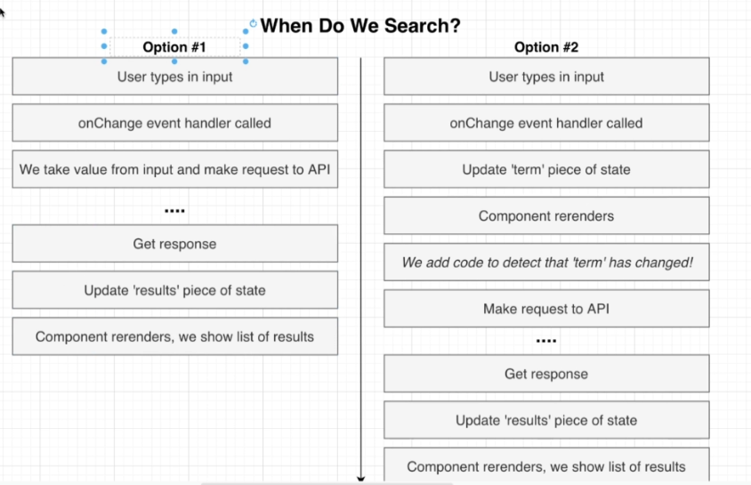
  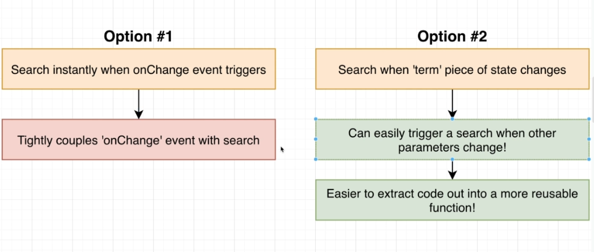
  
## Dropdown
### props, state, options
- props를 통해 options를 내려주는 방식 (Dropdown을 재사용하기 위해서)
- selection은 state임
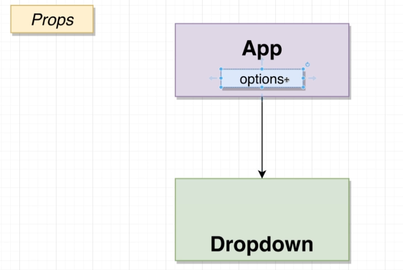
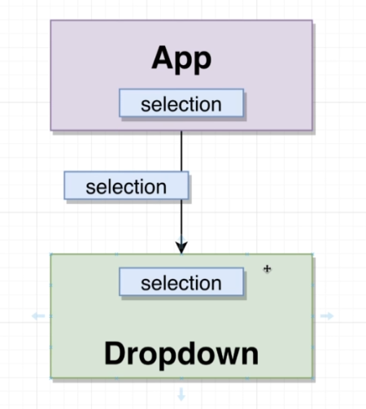
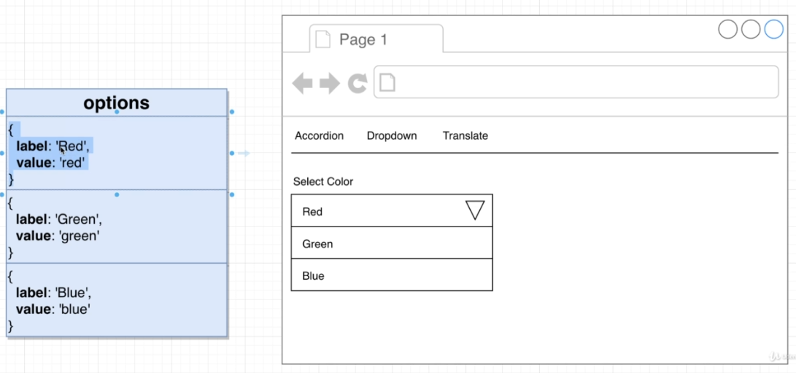