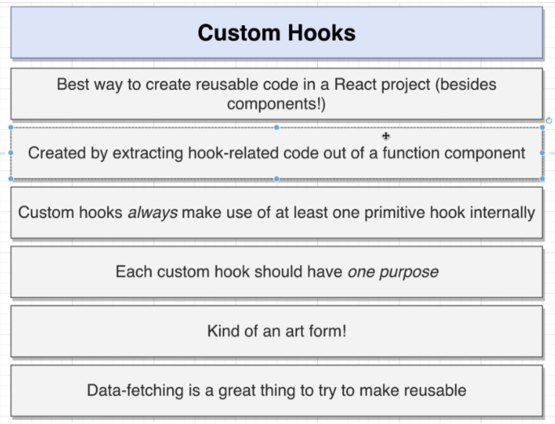
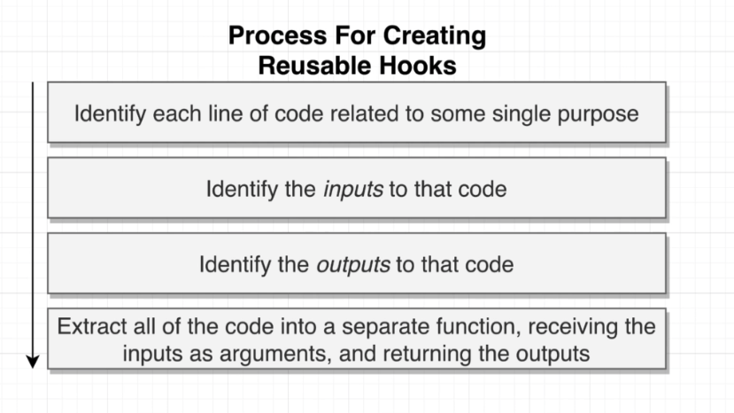
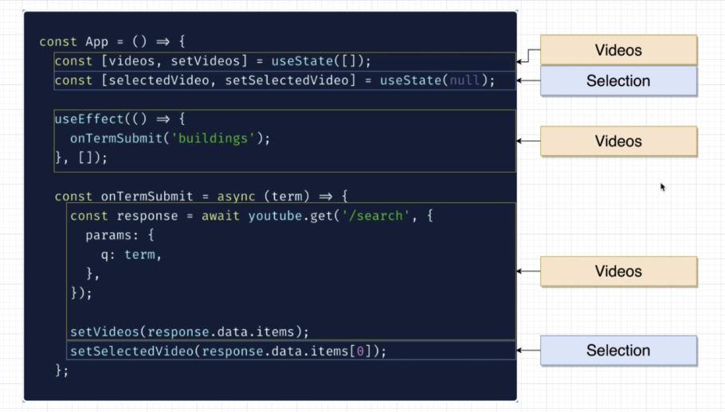
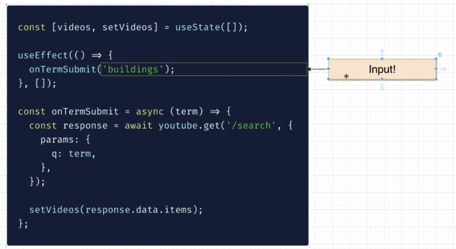
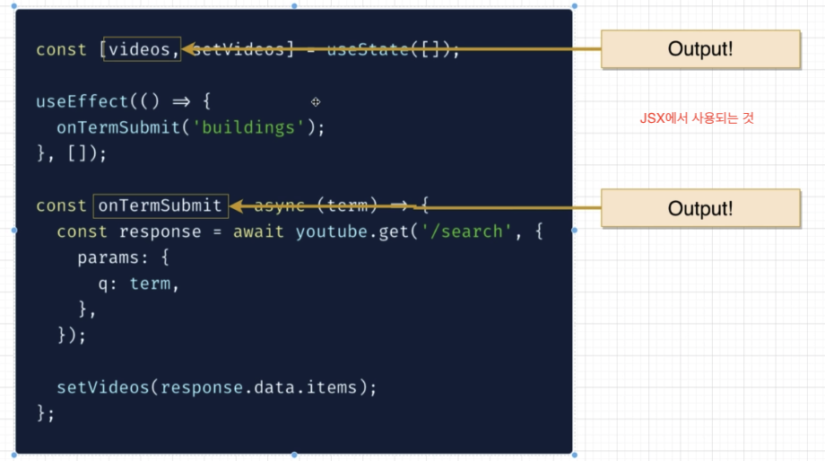

## Class Component를 Hooks로 바꾸기

- 바꿀때 특별한 우선순위없이 코드 위에서 아래로 순차적으로 바꿈
- Hooks로 바꾸면서 Hooks로 이득을 볼 수 있는 부분들을 바꿔준다.

### callback function의 간결화

- 아래 두 코드는 같은 코드이다. parameter가 하나인데, 그걸 그대로 받아서 실행하는 경우, 코드길이를 줄일 수 있다.
  ```javascript
  <VideoList
    videos={videos}
    onVideoSelect={(video) => setSelectedVideos(video)}
  />
  ```
  ```javascript
  <VideoList videos={videos} onVideoSelect={setSelectedVideos} />
  ```

### custom hooks

- custom hooks는 jsx를 포함하지 않고, 최소 1개 이상의 primitive hooks만 있도록 만든다. (jsx가 있어야한다면, component로 만들어야 함)
- 재 사용성을 위해 한가지 목적만 갖고 있어야한다.
  
  
- custom hook으로 분리할 때, 한가지 목적만 갖도록 분리한다. 또한 input과 ouput을 구분해야한다. input은 user로 부터 입력받는 값이거나 초기값이라고 생각하면 된다.
  
  
  
