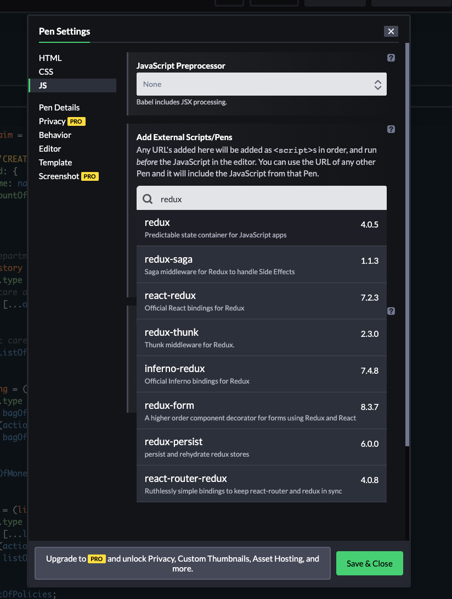
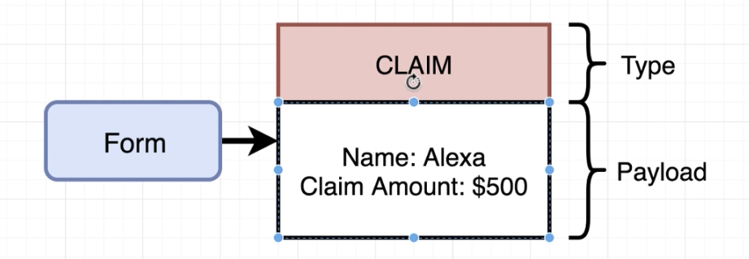
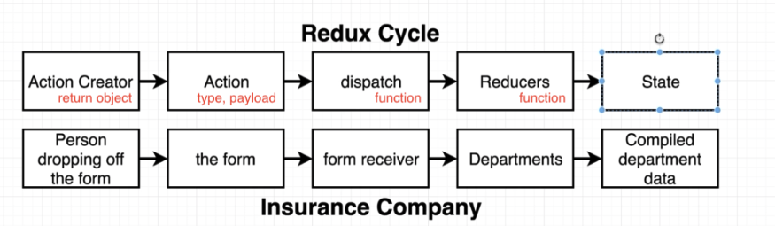
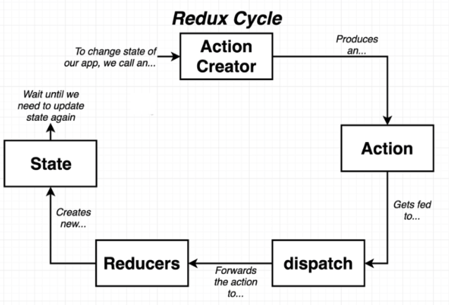

## Redux

[codepen example](https://codepen.io/stefan-cho/pen/JjEBgzv)

- codepen에서 redux 사용하는 방법: js에서 아래 이미지와 같이 추가하여 사용
  

### Reducer

- reducer로 업데이트 할때는 **항상** new array, new object를 return 해야함.
- reducer가 call 될때 초기값에 데이터가 따로 없으므로(`undefined`) 초기값을 넣어줘야함

### Redux Cycle

| name           | description                                                                                                                          |
| -------------- | ------------------------------------------------------------------------------------------------------------------------------------ |
| action creator | action을 return하는 function                                                                                                         |
| action         | object로 type, payload를 갖고 있음                                                                        |
| dispatch       | store의 function으로 state 업데이트 할 수 있는 유일한 수단                                                                           |
| reducers       | function으로 초기 state값과 action을 parameter로 받고 업데이트된 state를 return함, 이때 state는 반드시 새로운 array, object이어야 함 |

