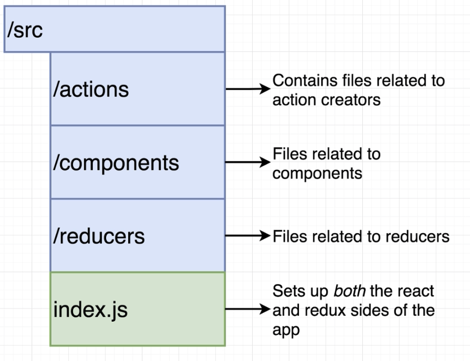
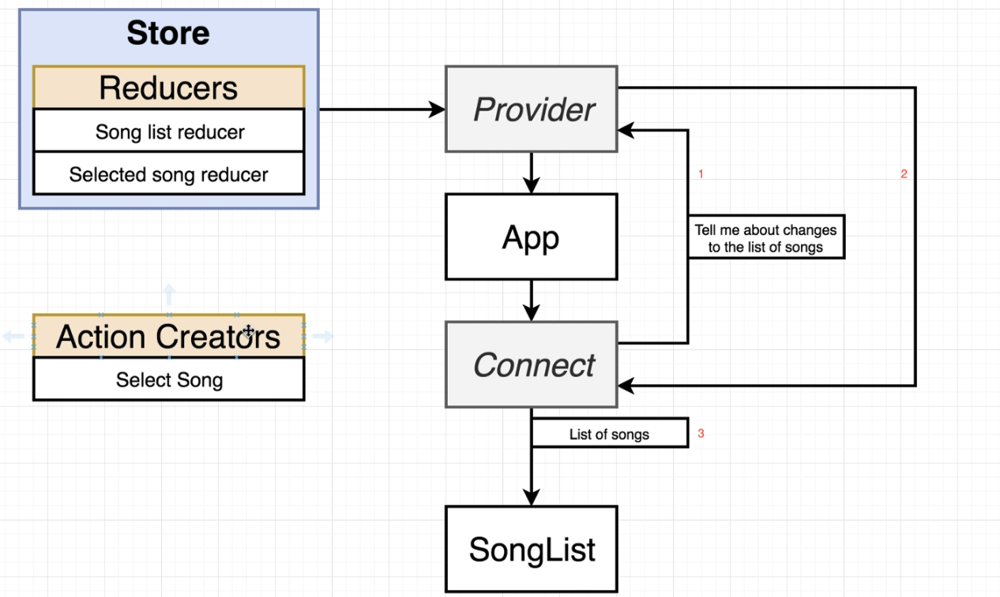

## Redux

### Provider, Connect component

- react-redux library
- instance를 만들어서 연결
- connect로 component를 wrap 해서 redux store에서 information(state)을 받을 수 있음

### named export

- 많은 여러가지 function들을 하나의 파일에서 export 하는 것 ( default export 와 비교됨 )

### Redux directory structure

### Redux communication

- connect를 통해 component의 변화를 Provider에 알려주고, Provider는 connect를 통해 component에 state를 제공하고 props로 쓸 수 있음
  

### connect 1번째 parameter 

- reducer state를 component에 props(connect로 연결되는 것)로 넘김, 따라서 this.props에서 쓸 수 있음
- name convention은 mapStateToProps
- 항상 mapStateToProps의 1번째 argument에 모든 state(object)가 넘어감
- mapStateToProps는 convention한 이름이고, 아무거나 써도 상관은 없음
- redux state가 바뀔때마다 mapStateToProps가 re-run 함

### connect 2번째 parameter

- connect의 2번째 parameter로 object를 넣는다.
- redux action을 object의 property로 넣어준다. 이것을 connect가 내부에서 다른 js로 감싸서 dispatch해주는 것임