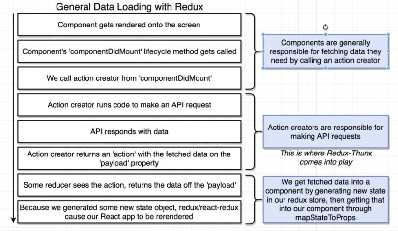
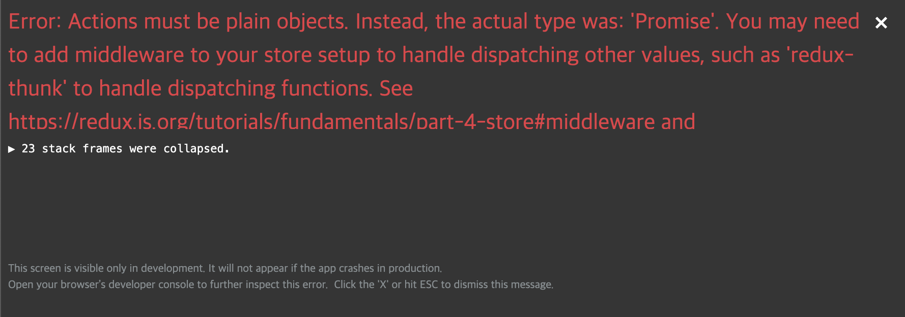
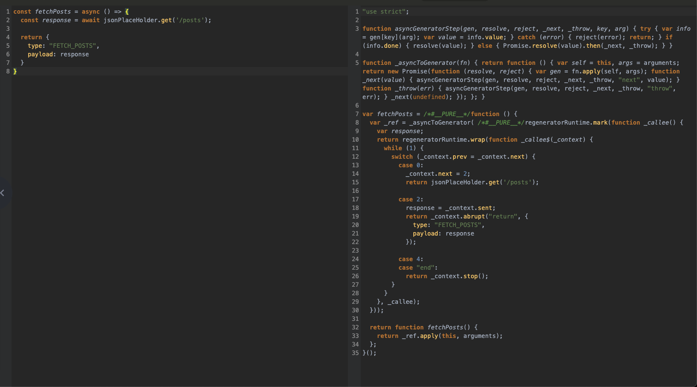
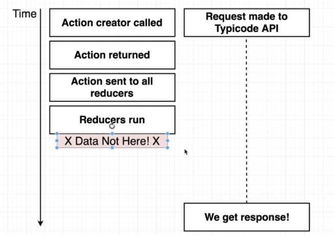
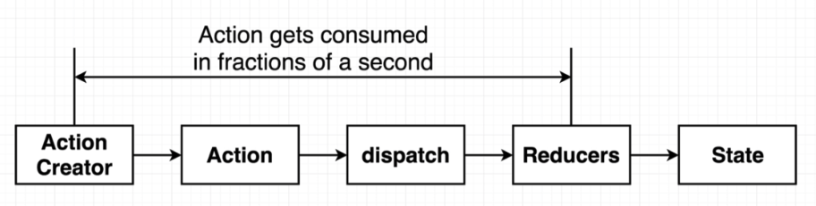
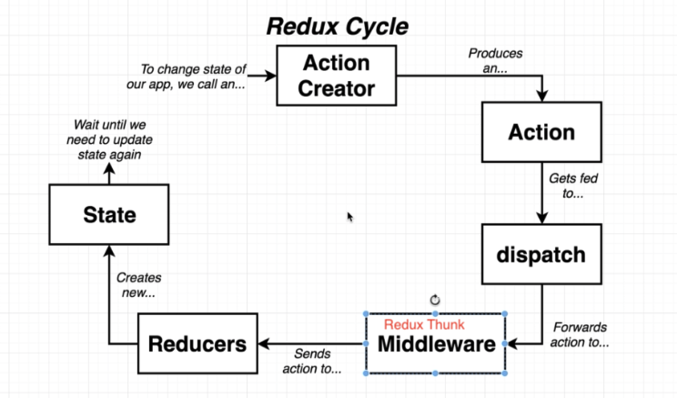
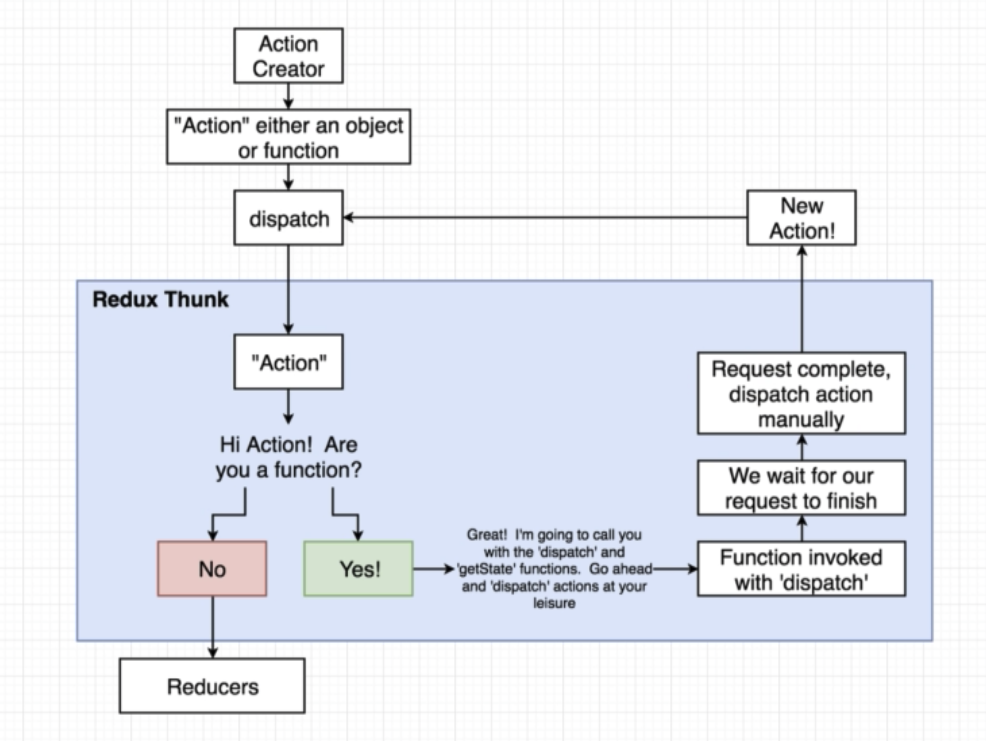

## Normal Rules

1. Action Creators **must** return action objects
2. Actions must have a type property
3. Actions can optionally have a 'payload'

## Rules with Redux Thunk

1. Action Creators **can** return action objects
1. Action Creators **can** return functions
1. If an action object gets returned, it must have a type
1. If an action object gets returned, it can optionally have a 'payload'

## General Data Loading with Redux



## What's wrong with fetchPosts?

1. Action creators must return plain JS objects with a type property
2. By the time our action gets to a reducer, we won't have fetched our data

### Bad Approach

- action creator안에 async/await를 사용하면 어떻게 되는가?

```javascript
export const fetchPosts = async () => {
  const response = await axios.get("https://your-domain/posts");

  return {
    type: "FETCH_POSTS",
    payload: response,
  };
};
```

- async/await 사용으로 error 발생
  

### 발생이유

- redux action은 plain object만 가능하다. async를 사용하면, promise를 return하는 case가 있다.
  아래 이미지의 es5 babel 변환코드를 보면, case 0의 경우 문제가 발생한다.



### Async Duration

Synchronous action creator: Instantly returns an action with data ready to go
Asynchronous action creator: Takes some amount of time for it to get its data ready to go



## Redux Cycle

- middleware는 dispatch 후에 실행된다.



### Redux Middleware

> Redux Middleware는 아래와 같은 특징이 있다.

- Function that gets called with every action we dispatch
- Has the ability to STOP, MODIFY, or otherwise mess around with actions
- Tons of open source middleware exist
- Most popular use of middleware is for dealing with async actions

### Redux Thunk

> Thunk의 function 처리 과정

- Thunk는 function일 경우, function 내부에 dispatch(action)을 직접 해줘야한다.
- async function이 사용가능하며, return값은 필수가 아니다.
- [src code](https://github.com/reduxjs/redux-thunk/blob/master/src/index.js) 참고해보자.
  

