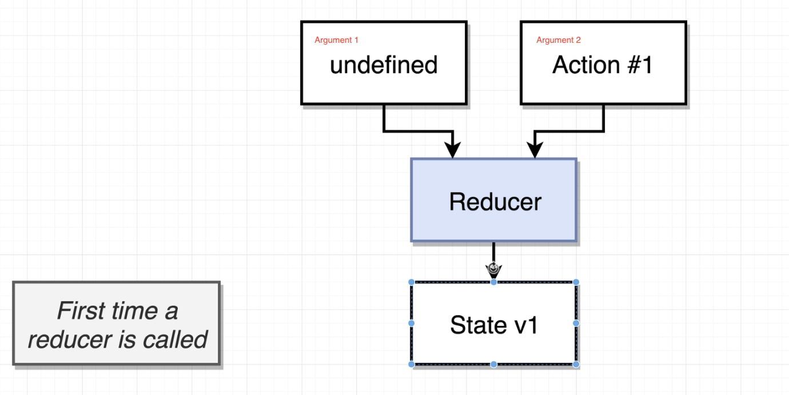
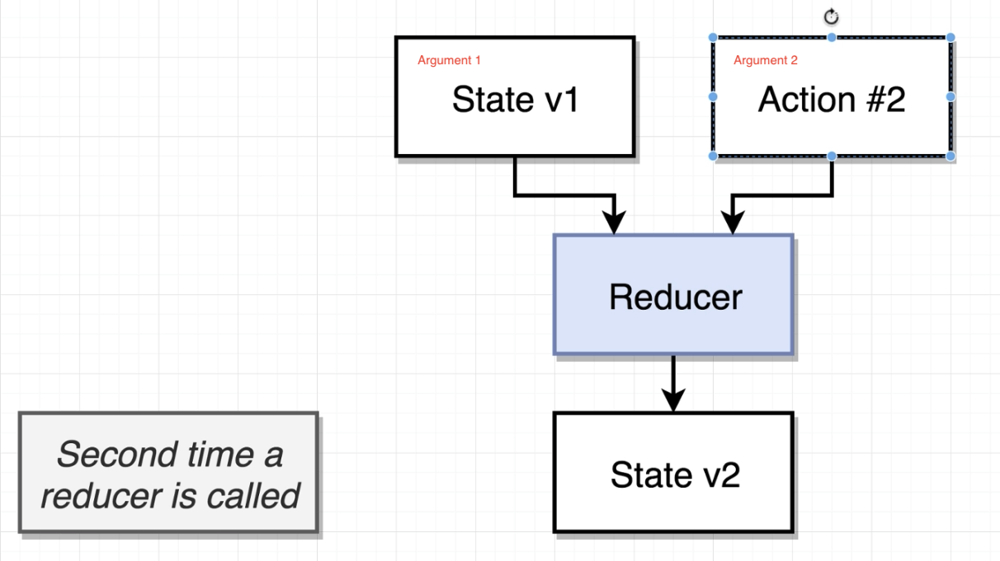
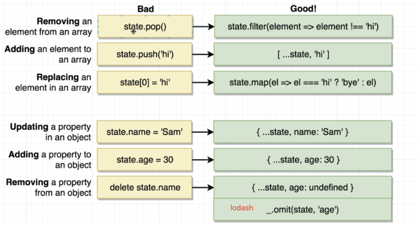
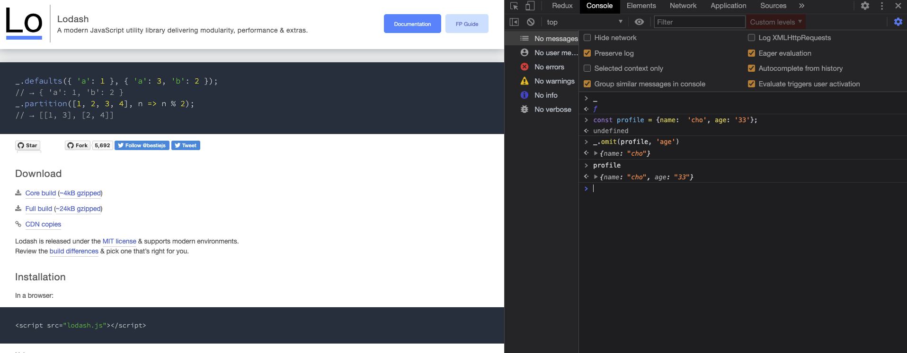
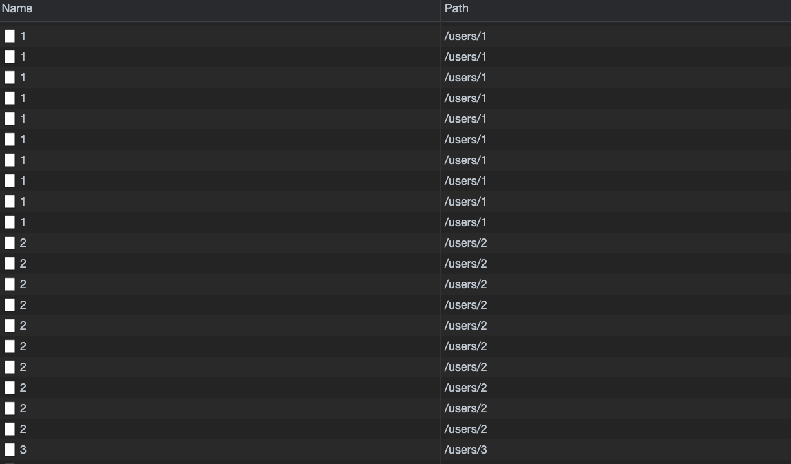
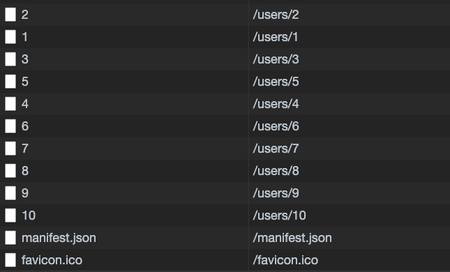

## Reducers

### Must return any value besides 'undefined'

- Reducers의 return값이 undefined가 아니어야한다. (반드시 한번 실행되므로)

### Produces 'state', or data to be used inside of your app using only previous state and the action

- application이 실행되면 최초에 반드시 한번 실행되므로 Reducers는 초기값을 줘야함

  | first time                                                    | second time                                                                                       |
  | ------------------------------------------------------------- | ------------------------------------------------------------------------------------------------- |
  |                       |                                                          |
  | 초기값이 undefined가 아니라 보통 `[]` 혹은 `''`으로 해야한다. | 그 전의 state(State v1)를 첫번째 argument로 다시 받는다, 따라서 argument 2(Action)만 계속 바뀐다. |

### Must not return reach 'out of itself' to decide what value to return (reducers are pure)

- reducer는 pure function이므로, 반드시 computing 가능한 값이어햐 한다.

  ```javascript
  export default (state = [], action) => {
    // Bad
    return document.querySelector("input");

    // Bad
    return axios.get("/posts");

    // Good : state와 action의 값으로만 계산됨, 여기에 map, filter, reducer등을 사용
    return state + action.payload;
  };
  ```

### Must not mutate its input 'state' argument (important!!!)

- array, object는 mutable
- string, number는 immutable

```javascript
export default (state = [], action) => {
  // Bad : state is array
  state[0] = "Sam";
  state.pop();
  state.push();

  // Bad : state is object
  state.name = "Sam";
  state.age = 30;

  // Good : state is string or number
  state = "Sam";
  state[0] = "X"; // state is still Sam, because string is immutable
};
```

- you can mutate it all day and not see any errors
- reducers의 state는 mutate되더라도, 에러가 발생하지 않는다. 아래는 [combineReducers](https://github.com/reduxjs/redux/blob/master/src/combineReducers.ts) 의 코드이다. 주석표시된부분[1]을 보면 값을 비교하고, 다를때만 nextState object를 return한다는 것을 알 수 있다.
- hasChanged가 false라면, state는 그 전 상태로 유지 되기 때문에, mutate하지말고, 새로운 array, object를 만들어야하는 것이다. (mutate하면, reference value는 그대로이므로, hasChanged는 false 이다.)

```javascript
let hasChanged = false;
const nextState: StateFromReducersMapObject<typeof reducers> = {};
for (let i = 0; i < finalReducerKeys.length; i++) {
  // combineReducers에 들어있는 모든 reducer들을 loop한다.
  const key = finalReducerKeys[i];
  const reducer = finalReducers[key];
  const previousStateForKey = state[key];
  const nextStateForKey = reducer(previousStateForKey, action);
  if (typeof nextStateForKey === "undefined") {
    const actionType = action && action.type;
    throw new Error(
      `When called with an action of type ${
        actionType ? `"${String(actionType)}"` : "(unknown type)"
      }, the slice reducer for key "${key}" returned undefined. ` +
        `To ignore an action, you must explicitly return the previous state. ` +
        `If you want this reducer to hold no value, you can return null instead of undefined.`
    );
  }
  nextState[key] = nextStateForKey;
  hasChanged = hasChanged || nextStateForKey !== previousStateForKey; // [1] 변경되었는지 확인한다.
}
hasChanged =
  hasChanged || finalReducerKeys.length !== Object.keys(state).length;
return hasChanged ? nextState : state;
```

### mutable vs immutable

- object를 삭제하는 방법은 lodash library를 사용하는 방법이 있다.
- lodash를 테스트하려면 [lodash](https://lodash.com/) 에 접속하여, console 창에 `_` 입력하면 테스트해볼 수 있다.
  
  

### Reducers의 일반적인 형태

- undefined를 return하면 안되므로, 끝에 `return state`를 써줌
- if/else 보다는 switch/case 가 더 일반적이다.

```javascript
export default (state = [], action) => {
  switch (action.type) {
    case "FETCH_POSTS":
      return action.payload;
    default:
      return state;
  }
};
```

### mapStateToProps ownProps

- mapStateToProps내에서 component 자체 props로 ownProps를 사용할 수 있다.

```javascript
const mapStateToProps = (state, ownProps) => {
  return {
    user: state.users.find((user) => user.id === ownProps.userId),
  };
};
```

### memoize fetch
#### 아래와 같이 같은 fetch를 여러번 하게 될 수가 있다.
```javascript
export const fetchUser = (id) => async dispatch => {
  const response = await jsonPlaceholder.get(`/users/${id}`);
  
  dispatch({ type: 'FETCH_USER', payload: response.data });
}
```
- 아래 이미지의 상황은 글 id는 다른데 작성자가 같은 경우, 이미 한번 호출했는데 여러번 호출하는 상황
- 

#### memoize로 이미 fetch한 id는 다시 fetch 하지 않는다.
- 변수명 앞에 `_`은 private 변수를 의미함
```javascript
export const fetchUser = id => dispatch => _fetchUser(id, dispatch);

const _fetchUser = _.memoize(async (id, dispatch) => {
  const response = await jsonPlaceholder.get(`/users/${id}`);
  
  dispatch({ type: 'FETCH_USER', payload: response.data });
})
```
- 

#### memoize 없이 하는 방법
- 새로운 fetchAndPosts라는 action을 만들어서 내부에서 처리해줌
- getState로 reducer의 state에 접근할 수 있다.

```javascript
export const fetchUserAndPosts = () => async (dispatch, getState) => {
  await dispatch(fetchPosts());
  
  const userIds = _.uniq(_.map(getState().posts, 'userId'));
  userIds.forEach(id => dispatch(fetchUser(id)));

  /* 같은 방식을 chain 사용해서 표현
   _.chain(getState().posts)
     .map('userId')
     .uniq()
     .forEach(id => dispatch(fetchUser(id)))
     .value();
  */
}

export const fetchPosts = () => async dispatch => {
  const response = await jsonPlaceholder.get('/posts');
  dispatch({ type: 'FETCH_POSTS', payload: response.data });
}

export const fetchUser = id => async dispatch => {
  const response = await jsonPlaceholder.get(`/users/${id}`);
  
  dispatch({ type: 'FETCH_USER', payload: response.data });
}
```