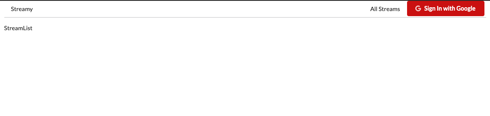

## Auth with Google

### 결과

| sign in                       | sign out                       |
| ----------------------------- | ------------------------------ |
|  |  |

### Logic

- login, logout state를 여러 component에서 사용하려면 아래 2가지 방법이 있다.(image 참고)

| 방법 1                          | 방법 2                          |
| ------------------------------- | ------------------------------- |
|  |  |

### oAuth의 방식 차이


- server로 OAuth하는 경우는, 로그인 되지 않았더라도 주기적으로 데이터에 접속이 필요한 경우이다.-
- ex\_ 유저의 이메일에 접근해서 스팸을 주기적으로 삭제한다던지 등
  
- OAuth에 대해서는 google 검색으로 `google oauth scope list` 정도로 검색하며 된다.

create new project
credentials -> create credentials -> OAuth client ID

## index.html

npm package가 따로 없기 때문에, 아래 script를 추가함

```html
<script src="https://apis.google.com/js/api.js"></script>
```

## Auth Component

- Get a reference to the 'auth' object after it is initialized
- Figure out if the user is currently signed in
- Print their authentication status on the screen

### gapi 사용

- component 내에서 연결

```javascript
  state = {
    isSignedIn: null
  }

  componentDidMount() {
    window.gapi.load('client:auth2', () => {
      window.gapi.client.init({
        clientId: '497792336027-7rtidmt7hbe6vsu9o0iku4bqtguvg27v.apps.googleusercontent.com',
        scope: 'email'
      }).then(() => {
        this.auth = window.gapi.auth2.getAuthInstance();
        this.setState({ isSignedIn: this.auth.isSignedIn.get() })
      })
    });
  }
```

- signIn : `gapi.auth2.getAuthInstance().signIn()`
- signOut : `gapi.auth2.getAuthInstance().signOut()`
- currentUser: `gapi.auth2.getAuthInstance().currentUser.get().getId()`

docs link : https://developers.google.com/identity/sign-in/web/reference#authentication
(또는 gapi documentation으로 검색)

## Reducer

### types.js로 type이름을 따로 빼는 이유

- type은 아래와 같이 string 값을 갖는다. string은 입력하다가 오타를 낼 가능성이 있으므로 아예 타입이름(string)을 갖는 변수를 만들어서 그걸로 사용하는것이다. string명은 틀려도 오류가 나지 않아서 위험하지만, 변수명은 틀리면 오류를 보여주기 때문이다.
- 타입변수는 action과 reducer에서 사용하게 된다.

```javascript
const SING_IN = 'SIGN_IN';

case 'SIGN_IN':     // Bad!
case SING_IN:       // Good!!

{
  type: 'SIGN_IN'   // Bad!
}
{
  type: SIGN_IN     // Good!
}
```

